---

## 🎯 Objectives of the Lab

This hands-on lab is designed to achieve the following core operational and technical objectives:

* **Implement Infrastructure Automation:** Eliminate manual operational tasks by replacing console-based workflows with programmatic, automated scripts.
* **Master Serverless Orchestration:** Understand how to decouple services and trigger serverless code blocks efficiently using event-driven architectures.
* **Optimize Cloud Costs (FinOps):** Simulate dynamic resource scaling strategies (vertical scaling) to match real-world business demands—minimizing active running costs during off-peak windows.
* **Enforce Secure Access Frameworks:** Implement cloud security best practices using the **Principle of Least Privilege** through customized AWS Identity and Access Management (IAM) execution roles.
* **Build Resilience through Debugging:** Gain practical exposure to analyzing runtime exceptions, configuring optimal execution timeout limits, and overriding environment-specific restrictions.

---


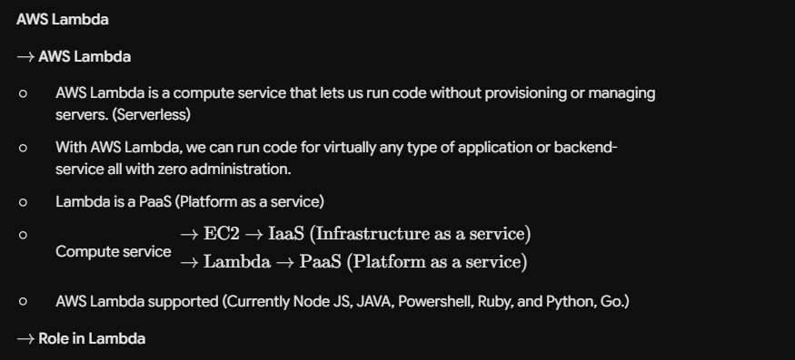


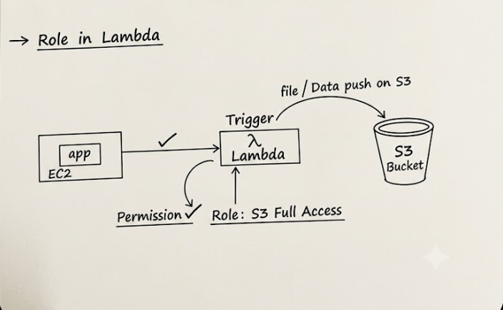


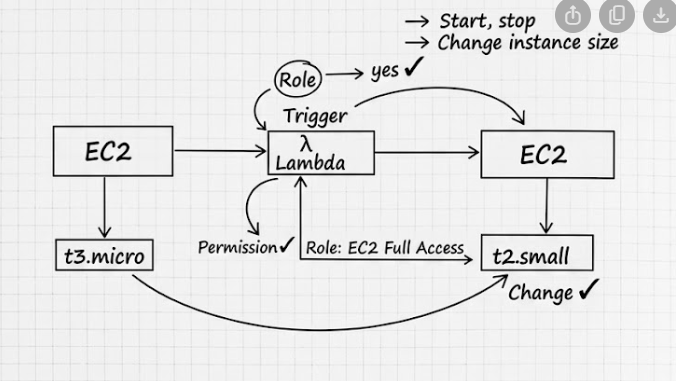


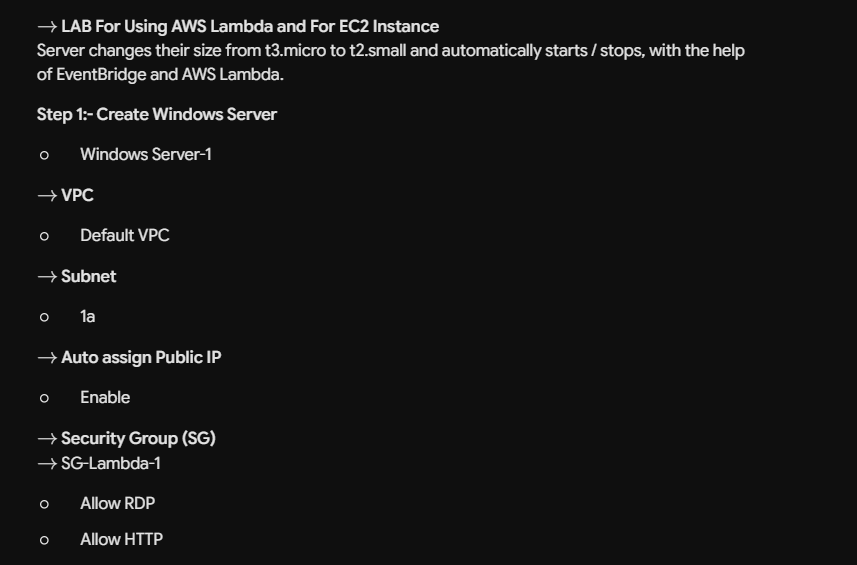


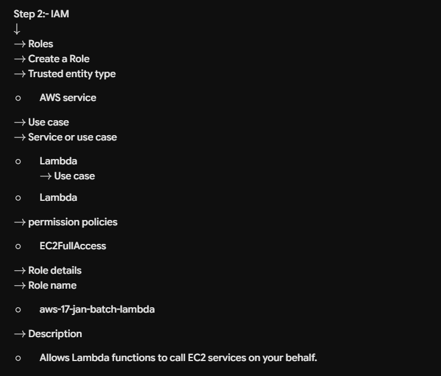


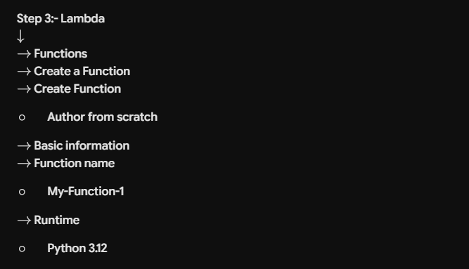


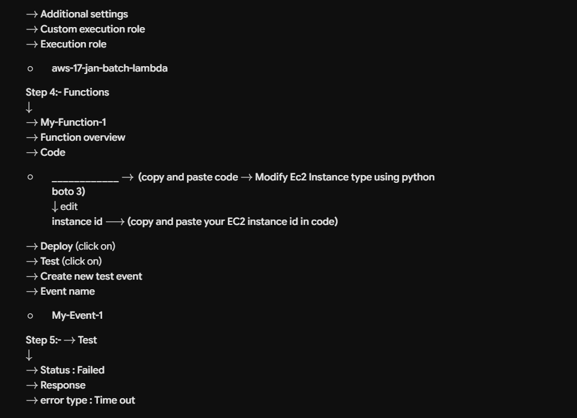


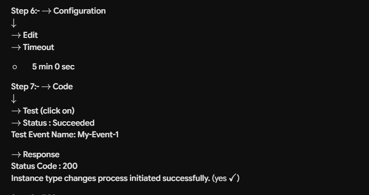


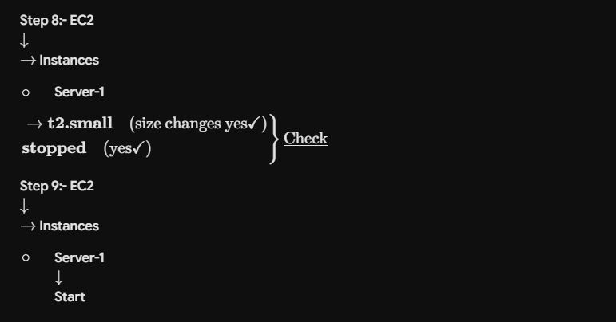


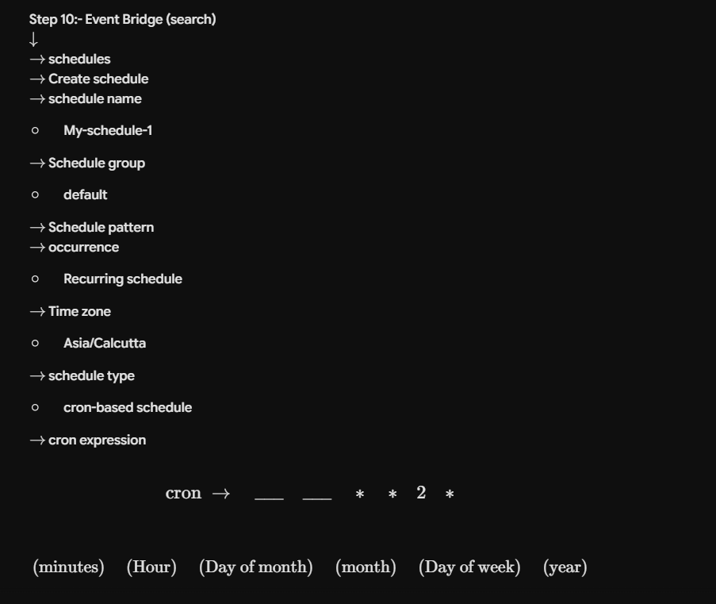


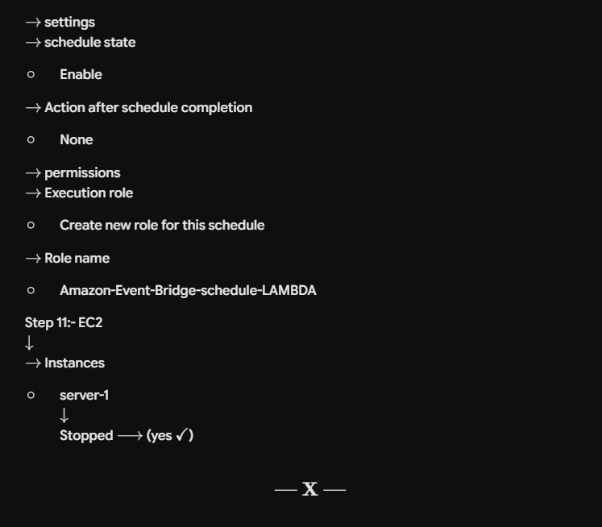


```markdown
# AWS Lambda & EventBridge EC2 Auto-Scaling Lab

This repository contains the complete step-by-step documentation for configuring an automated AWS architecture. The lab demonstrates how to use **AWS Lambda** and **Amazon EventBridge** to automatically modify an EC2 instance's type (scaling it from `t3.micro` to `t2.small`) and manage its state based on a custom schedule.

---

## Lab Architecture Overview

Before starting, it helps to understand what you are building. You will deploy a Windows EC2 instance, create an IAM execution role that grants Lambda permission to manage EC2 resources, write a Python script inside an AWS Lambda function using `boto3` to change the instance type, and finally schedule that function using EventBridge.

```text
+------------------+         Trigger          +-------------------+
|  Amazon          | -----------------------> |  AWS Lambda       |
|  EventBridge     |                          |  (My-Function-1)  |
|  (My-Schedule-1) |                          +-------------------+
+------------------+                                    |
                                                        | Invokes with
                                                        | EC2FullAccess
                                                        v
+------------------+     Changes Type from    +-------------------+
|   EC2 Instance   | <----------------------- |    EC2 Actions    |
| (t3.micro -> t2) |     t3.micro to t2.small |  (Stop & Modify)  |
+------------------+                          +-------------------+

```

---

## Step 1: Create the Windows EC2 Instance

1. Open the **AWS Management Console** and navigate to **EC2**.
2. Click **Launch Instance**.
3. **Name:** Enter `Server-1`.
4. **Application and OS Images (AMI):** Select **Windows** (e.g., *Microsoft Windows Server 2022 Base*).
5. **Instance Type:** Select `t3.micro`.
6. **Network Settings:**
* **VPC:** Select your **Default VPC**.
* **Subnet:** Choose any available subnet zone (e.g., `1a`).
* **Auto-assign Public IP:** Set to **Enable**.


7. **Security Group (SG):**
* Select **Create security group**.
* **Security group name:** `SG-Lambda-1`.
* **Inbound Rules:**
* Allow **RDP** (Port 3389)
* Allow **HTTP** (Port 80)


8. Click **Launch Instance**.
9. Once launched, go to your instances list and **copy the Instance ID** (you will need this for your Lambda script).

---

## Step 2: Create the IAM Role for Lambda

Because AWS services cannot interact with each other without explicit permissions, you need to grant Lambda permission to modify your EC2 instance.

1. Navigate to the **IAM** (Identity and Access Management) console.
2. In the left navigation pane, click **Roles**, then click **Create role**.
3. **Trusted entity type:** Select **AWS service**.
4. **Service or use case:** Select **Lambda** from the dropdown, then click **Next**.
5. **Permissions policies:** Search for and check the box next to **`AmazonEC2FullAccess`**, then click **Next**.
6. **Role details:**
* **Role name:** `aws-17-jan-batch-lambda`
* **Description:** `Allows Lambda functions to call EC2 services on your behalf.`


7. Click **Create role**.

---

## Step 3: Create the AWS Lambda Function

1. Navigate to the **AWS Lambda** console.
2. Click **Create function**.
3. Select **Author from scratch**.
4. **Basic information:**
* **Function name:** `My-Function-1`
* **Runtime:** Select **Python 3.12** (or the latest stable Python 3.x version).


5. **Change default execution role:**
* Expand **Advanced settings** / **Execution role**.
* Select **Use an existing role**.
* Choose the role you created: `aws-17-jan-batch-lambda`.


6. Click **Create function**.

---

## Step 4: Write and Deploy the Lambda Code

1. In your function dashboard, scroll down to the **Code** tab.
2. In the built-in code editor (`lambda_function.py`), clear the default template and copy-paste the following Python script:

```python
import boto3
import time

def lambda_handler(event, context):
    # Initialize the EC2 client (adjust the region string if your instance is elsewhere)
    ec2 = boto3.client('ec2', region_name='us-east-1') 
    instance_id = 'YOUR_EC2_INSTANCE_ID_HERE'
    
    # 1. Stop the instance (Instance must be stopped to change its type)
    print(f"Stopping instance: {instance_id}")
    ec2.stop_instances(InstanceIds=[instance_id])
    
    # Wait until the instance is fully stopped before changing type
    print("Waiting for instance to reach 'stopped' state...")
    waiter = ec2.get_waiter('instance_stopped')
    waiter.wait(InstanceIds=[instance_id])
    
    # 2. Change the instance type to t2.small
    print(f"Changing instance type to t2.small")
    ec2.modify_instance_attribute(InstanceId=instance_id, InstanceType={'Value': 't2.small'})
    
    return {
        'statusCode': 200,
        'body': 'Instance type changes process initiated successfully.'
    }

```

3. **Replace** `'YOUR_EC2_INSTANCE_ID_HERE'` with the actual Instance ID you copied in Step 1.
4. Click the **Deploy** button at the top of the editor to save and publish your changes.

---

## Step 5: Adjust Configuration & Test

If you test the function right now, it will fail with an **error type: Time out** because Lambda's default execution timeout limit is only 3 seconds, which isn't enough time for an EC2 instance to safely power down.

### Adjust Timeout

1. Inside your Lambda function dashboard, go to the **Configuration** tab.
2. Select **General configuration** on the left menu, then click **Edit**.
3. Change the **Timeout** to **5 min 0 sec**.
4. Click **Save**.

### Test the Function

1. Go back to the **Code** tab.
2. Click the **Test** button dropdown and select **Configure test event**.
3. In the configure window:
* **Event name:** `My-Event-1`
* Leave the JSON payload as default `{}`.


4. Click **Save**, then click the main **Test** button.
5. **Verify:** You should see a green box stating **Status: Succeeded** with a `200` status code and the message `"Instance type changes process initiated successfully."`

### Check the EC2 Instance

1. Head back to the **EC2 console** -> **Instances**.
2. Select `Server-1`. You should observe its state change to **Stopped**, and its instance type successfully update from `t3.micro` to `t2.small` ($\checkmark$ **Change**).
3. Manually **Start** the instance again to prepare for the schedule automation step.

---

## Step 6: Automate Using EventBridge Schedules

Now, automate the execution of your script using a recurring cron schedule.

1. Navigate to the **Amazon EventBridge** console.
2. In the left panel under **Scheduler**, click **Schedules**, then click **Create schedule**.
3. **Schedule details:**
* **Schedule name:** `My-schedule-1`
* **Schedule group:** `default`


4. **Schedule pattern:**
* **Occurrence:** Select **Recurring schedule**.
* **Time zone:** Select your preferred local timezone (e.g., `Asia/Calcutta`).
* **Schedule type:** Select **Cron-based schedule**.
* **Cron expression:** Enter your expression:
```text
cron(minutes Hour Day_of_month month Day_of_week year)

```


*Example pattern from notes:* `cron(0 0 * * 2 *)` (runs weekly on specific schedules).


5. **Flexible time window:** Turn this **Off** (so it runs precisely on the exact minute). Click **Next**.
6. **Select target:**
* **Target API:** Choose **Templated targets**.
* Select **AWS Lambda** from the options list.
* Under **Lambda function**, choose **`My-Function-1`**. Click **Next**.


7. **Settings:**
* **Schedule state:** Set to **Enable**.
* **Action after schedule completion:** Set to **None**.


8. **Permissions:**
* Select **Create new role for this schedule**.
* **Role name:** `Amazon-Event-Bridge-schedule-LAMBDA`


9. Click **Next**, review the details, and click **Create schedule**.

### Final Verification

Once the cron job hits its scheduled time, EventBridge will automatically trigger your Lambda function. You can verify this by checking the EC2 dashboard: `Server-1` will automatically turn off and convert to a `t2.small` instance completely unattended ($\checkmark$ **Stopped**).

```


# AWS Cloud Lab: Post-Lab Documentation & Insights

---

## 🛑 Post-Lab Cleanup Steps

AWS resources cost money when left running or active. Follow these steps to clean up your environment completely and avoid unnecessary charges:

### 1. Delete the EventBridge Schedule
Since your schedule is set to run every 5 minutes, it will keep triggering your Lambda function endlessly if left active.
* Navigate to **Amazon EventBridge** $\rightarrow$ **Schedules**.
* Select `my-schedule-1`.
* Click **Delete** and confirm.

### 2. Terminate the EC2 Instance
* Navigate to the **EC2 Console** $\rightarrow$ **Instances**.
* Select your instance (`Server-1`).
* Click **Instance state** $\rightarrow$ **Terminate instance**. *(Note: This will completely delete the virtual machine so it stops accumulating charges).*

### 3. Delete the Lambda Function
* Navigate to the **AWS Lambda** console $\rightarrow$ **Functions**.
* Check the box next to `my-function-1`.
* Click **Actions** $\rightarrow$ **Delete**.

### 4. Remove the IAM Role
* Navigate to the **IAM Console** $\rightarrow$ **Roles**.
* Search for `aws-17-jan-batch-lambda`.
* Select it and click **Delete**.

---

## 🎯 Purpose of the Lab

In a real-world enterprise environment, nobody resizes servers manually in the middle of the night. The core purpose of this lab is to master **Serverless Infrastructure Automation**.

Imagine an e-commerce or retail business that experiences massive user traffic during daytime working hours but almost zero traffic at night. Instead of paying for expensive, high-performance servers 24/7, companies implement this exact EventBridge + Lambda workflow to automatically **scale down** or alter server sizes during off-peak hours to save thousands of dollars, automatically scaling them back up right before the next workday begins.

---

## 🧠 Key Takeaways

* **Serverless Compute (AWS Lambda):** You learned that Lambda operates as a **PaaS (Platform as a Service)**. You don't have to provision an OS or manage a virtual machine to execute code; you simply upload a Python script, pay only for the exact milliseconds it runs, and AWS handles the underlying infrastructure.
* **Event-Driven Architecture:** You mastered how **Amazon EventBridge** acts as a centralized brain or an automated alarm clock, utilizing custom **Cron Expressions** to trigger target AWS services predictably without human intervention.
* **Programmatic AWS Management (`boto3`):** Instead of manually clicking buttons inside the AWS Management Console, you discovered how to interact with cloud infrastructure through code. Writing automation scripts with Python's `boto3` SDK is a fundamental skill for DevOps and Cloud Engineers.
* **IAM Security (Principle of Least Privilege):** You practiced creating explicit execution boundaries. You learned that an AWS Lambda function is securely isolated by default and cannot modify an EC2 instance unless you explicitly grant it permission via an attached **IAM Role**.
* **Handling Limitations & Debugging:** Encountering runtime blockers like `FreeTierRestrictionError` or execution `Timeout` errors taught you how to analyze AWS CloudWatch logs, adjust resource configurations (like raising the timeout threshold to 5 minutes), and safely pivot architectural strategies when working within cloud provider constraints.