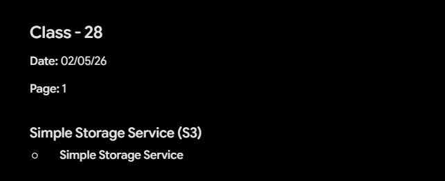


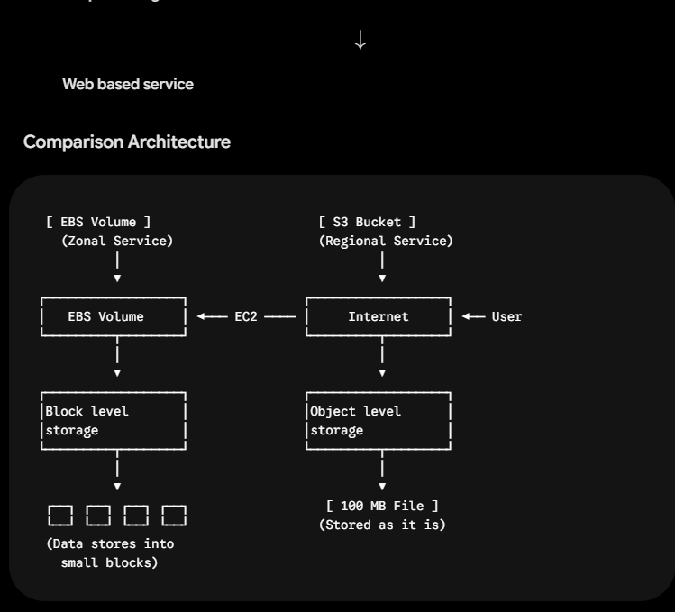


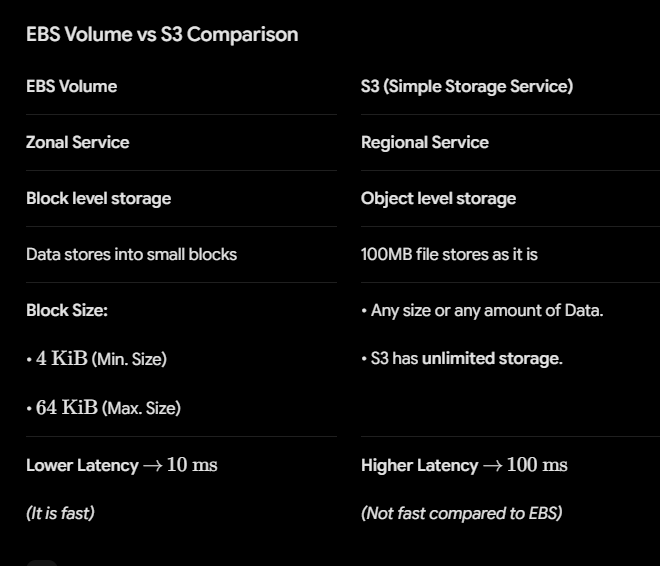

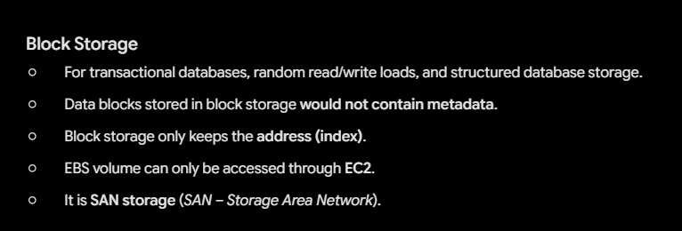


---

## **Class - 28**

**Date:** 02/05/26

**Page:** 1

### **Simple Storage Service (S3)**

* **Simple Storage Service**

$$\downarrow$$


**Web based service**

---

### **Comparison Architecture**

```
 [ EBS Volume ]                      [ S3 Bucket ]
   (Zonal Service)                   (Regional Service)
          │                                  │
          ▼                                  ▼
┌──────────────────┐               ┌──────────────────┐
│   EBS Volume     │ ◄─── EC2 ──── │     Internet     │ ◄── User
└─────────┬────────┘               └─────────┬────────┘
          │                                  │
          ▼                                  ▼
┌──────────────────┐               ┌──────────────────┐
│Block level       │               │Object level      │
│storage           │               │storage           │
└─────────┬────────┘               └─────────┬────────┘
          │                                  │
          ▼                                  ▼
 ┌──┐ ┌──┐ ┌──┐ ┌──┐                  [ 100 MB File ]
 └──┘ └──┘ └──┘ └──┘                 (Stored as it is)
 (Data stores into
   small blocks)

```

---

### **EBS Volume vs S3 Comparison**

| **EBS Volume** | **S3 (Simple Storage Service)** |
| --- | --- |
| **Zonal Service** | **Regional Service** |
| **Block level storage** | **Object level storage** |
| Data stores into small blocks | 100MB file stores as it is |
| **Block Size:**<br>

<br>• $4\text{ KiB}$ (Min. Size)<br>

<br>• $64\text{ KiB}$ (Max. Size) | • Any size or any amount of Data.<br>

<br>• S3 has **unlimited storage**. |
| **Lower Latency** $\rightarrow$ $10\text{ ms}$<br>

<br>*(It is fast)* | **Higher Latency** $\rightarrow$ $100\text{ ms}$<br>

<br>*(Not fast compared to EBS)* |

---

### **Block Storage**

* For transactional databases, random read/write loads, and structured database storage.
* Data blocks stored in block storage **would not contain metadata**.
* Block storage only keeps the **address (index)**.
* EBS volume can only be accessed through **EC2**.
* It is **SAN storage** (*SAN – Storage Area Network*).


-----------------xxxxxxxxxxxx----------------------


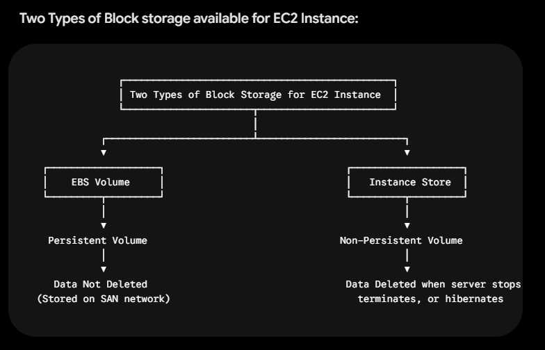


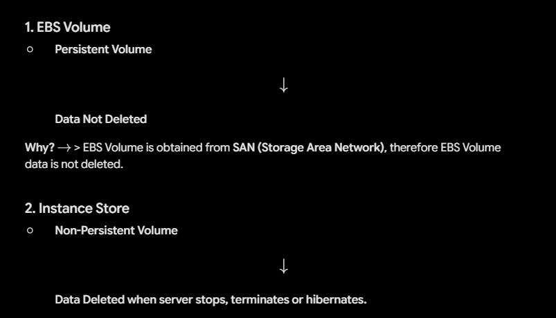


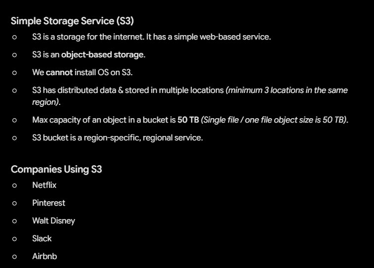


Here is the transcript of **Page 2** from your handwritten notes, formatted with diagrams and translated text where applicable.

---

## **Page: 2**

### **Two Types of Block storage available for EC2 Instance:**

```
               ┌──────────────────────────────────────────────┐
               │ Two Types of Block Storage for EC2 Instance  │
               └──────────────────────┬───────────────────────┘
                                      │
            ┌─────────────────────────┴─────────────────────────┐
            ▼                                                   ▼
  ┌───────────────────┐                               ┌───────────────────┐
  │    EBS Volume     │                               │   Instance Store  │
  └─────────┬─────────┘                               └─────────┬─────────┘
            │                                                   │
            ▼                                                   ▼
   Persistent Volume                                 Non-Persistent Volume
            │                                                   │
            ▼                                                   ▼
    Data Not Deleted                                  Data Deleted when server stops,
 (Stored on SAN network)                                terminates, or hibernates

```

---

### **1. EBS Volume**

* **Persistent Volume**

$$\downarrow$$


**Data Not Deleted**

> **Why? $\rightarrow$** > EBS Volume is obtained from **SAN (Storage Area Network)**, therefore EBS Volume data is not deleted.

---

### **2. Instance Store**

* **Non-Persistent Volume**

$$\downarrow$$


**Data Deleted when server stops, terminates or hibernates.**

---

---

### **Simple Storage Service (S3)**

* S3 is a storage for the internet. It has a simple web-based service.
* S3 is an **object-based storage**.
* We **cannot** install OS on S3.
* S3 has distributed data & stored in multiple locations *(minimum 3 locations in the same region)*.
* Max capacity of an object in a bucket is **50 TB** *(Single file / one file object size is 50 TB)*.
* S3 bucket is a region-specific, regional service.

---

### **Companies Using S3**

* Netflix
* Pinterest
* Walt Disney
* Slack
* Airbnb


----------------xxxxxxxxxxxx-------------------


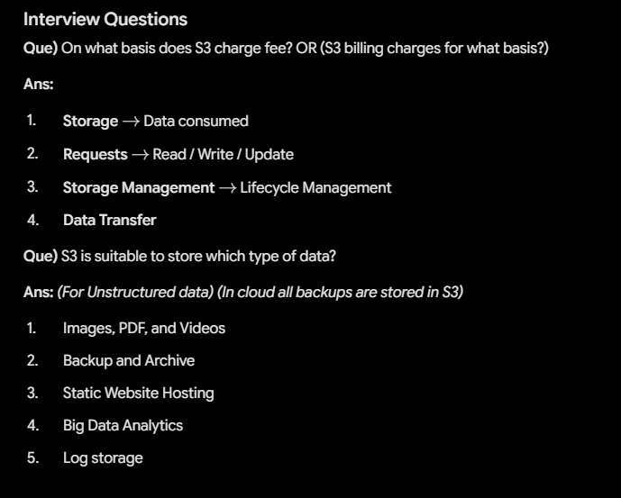


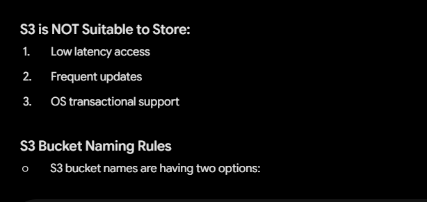


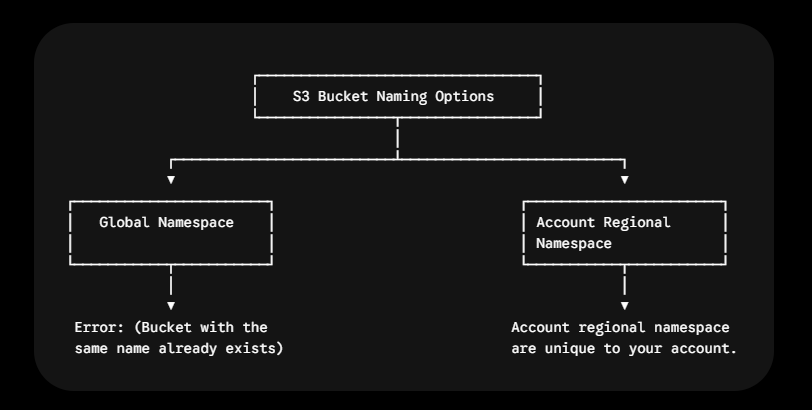


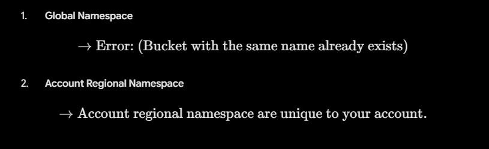


---

## **Page: 3**

### **Interview Questions**

**Que)** On what basis does S3 charge fee? OR (S3 billing charges for what basis?)

**Ans:**

1. **Storage** $\rightarrow$ Data consumed
2. **Requests** $\rightarrow$ Read / Write / Update
3. **Storage Management** $\rightarrow$ Lifecycle Management
4. **Data Transfer**

---

**Que)** S3 is suitable to store which type of data?

**Ans:** *(For Unstructured data)* *(In cloud all backups are stored in S3)*

1. Images, PDF, and Videos
2. Backup and Archive
3. Static Website Hosting
4. Big Data Analytics
5. Log storage

---

### **S3 is NOT Suitable to Store:**

1. Low latency access
2. Frequent updates
3. OS transactional support

---

### **S3 Bucket Naming Rules**

* S3 bucket names are having two options:

```
                      ┌─────────────────────────────────┐
                      │    S3 Bucket Naming Options     │
                      └────────────────┬────────────────┘
                                       │
            ┌──────────────────────────┴──────────────────────────┐
            ▼                                                     ▼
┌───────────────────────┐                             ┌───────────────────────┐
│   Global Namespace    │                             │ Account Regional      │
│                       │                             │ Namespace             │
└───────────┬───────────┘                             └───────────┬───────────┘
            │                                                     │
            ▼                                                     ▼
 Error: (Bucket with the                             Account regional namespace
 same name already exists)                           are unique to your account.

```

1. **Global Namespace**

$$\rightarrow \text{Error: (Bucket with the same name already exists)}$$


2. **Account Regional Namespace**

$$\rightarrow \text{Account regional namespace are unique to your account.}$$


----------xxxxxxxxxxxxxxxxxxxxxx--------------------


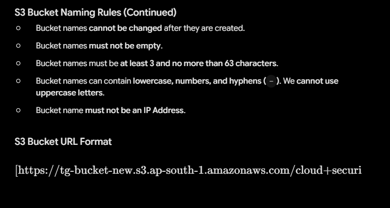


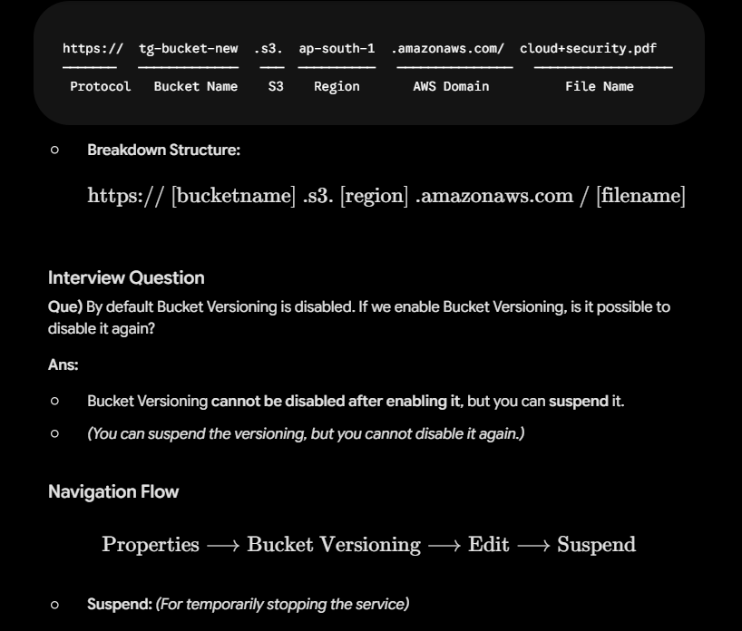


---

## **Page: 4**

### **S3 Bucket Naming Rules (Continued)**

* Bucket names **cannot be changed** after they are created.
* Bucket names **must not be empty**.
* Bucket names must be **at least 3 and no more than 63 characters**.
* Bucket names can contain **lowercase, numbers, and hyphens (`-`)**. We **cannot use uppercase letters**.
* Bucket name **must not be an IP Address**.

---

### **S3 Bucket URL Format**

$$\text{[https://tg-bucket-new.s3.ap-south-1.amazonaws.com/cloud+security.pdf](https://tg-bucket-new.s3.ap-south-1.amazonaws.com/cloud+security.pdf)}$$

```
https://  tg-bucket-new  .s3.  ap-south-1  .amazonaws.com/  cloud+security.pdf
───────   ─────────────   ───  ──────────   ───────────────   ──────────────────
 Protocol   Bucket Name    S3    Region       AWS Domain          File Name

```

* **Breakdown Structure:**

$$\text{https:// [bucketname] .s3. [region] .amazonaws.com / [filename]}$$


---

### **Interview Question**

**Que)** By default Bucket Versioning is disabled. If we enable Bucket Versioning, is it possible to disable it again?

**Ans:**

* Bucket Versioning **cannot be disabled after enabling it**, but you can **suspend** it.
* *(You can suspend the versioning, but you cannot disable it again.)*

---

### **Navigation Flow**

$$\text{Properties} \longrightarrow \text{Bucket Versioning} \longrightarrow \text{Edit} \longrightarrow \text{Suspend}$$

* **Suspend:** *(For temporarily stopping the service)*


----------xxxxxxxxxxxxxxxxxxxxxxxxxx----------------------


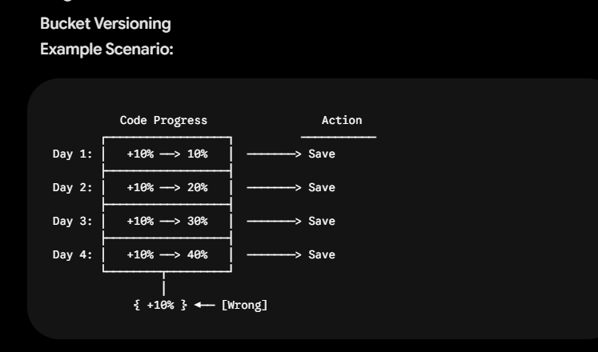


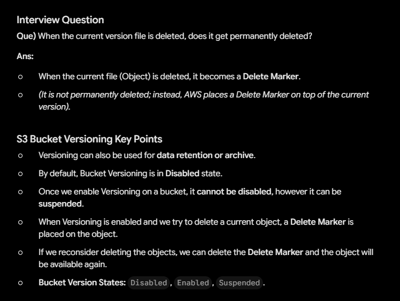


---

## **Page: 5**

### **Bucket Versioning**

#### **Example Scenario:**

```
          Code Progress                 Action
       ┌──────────────────┐          ───────────
Day 1: │   +10% ──> 10%   │  ───────> Save
       ├──────────────────┤
Day 2: │   +10% ──> 20%   │  ───────> Save
       ├──────────────────┤
Day 3: │   +10% ──> 30%   │  ───────> Save
       ├──────────────────┤
Day 4: │   +10% ──> 40%   │  ───────> Save
       └────────┬─────────┘
                │
            { +10% } ◄── [Wrong]

```

---

### **Interview Question**

**Que)** When the current version file is deleted, does it get permanently deleted?

**Ans:**

* When the current file (Object) is deleted, it becomes a **Delete Marker**.
* *(It is not permanently deleted; instead, AWS places a Delete Marker on top of the current version).*

---

### **S3 Bucket Versioning Key Points**

* Versioning can also be used for **data retention or archive**.
* By default, Bucket Versioning is in **Disabled** state.
* Once we enable Versioning on a bucket, it **cannot be disabled**, however it can be **suspended**.
* When Versioning is enabled and we try to delete a current object, a **Delete Marker** is placed on the object.
* If we reconsider deleting the objects, we can delete the **Delete Marker** and the object will be available again.
* **Bucket Version States:** `Disabled`, `Enabled`, `Suspended`.


------------------xxxxxxxxxxxxxxxxxxxxxxxxxxx-------------------------


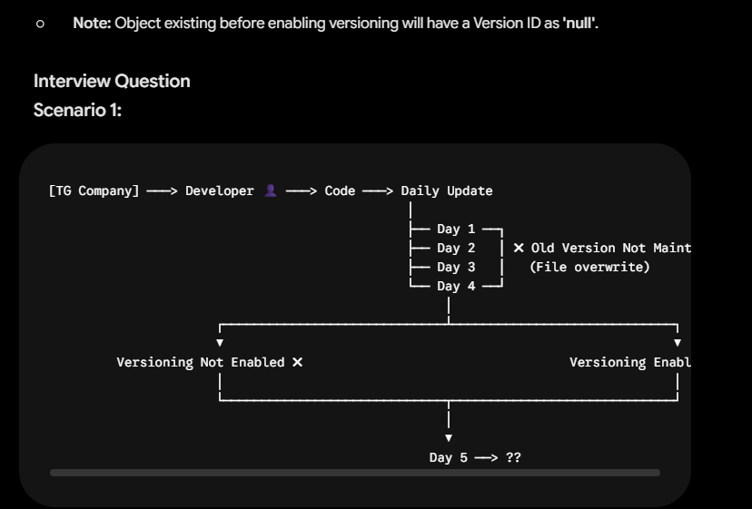


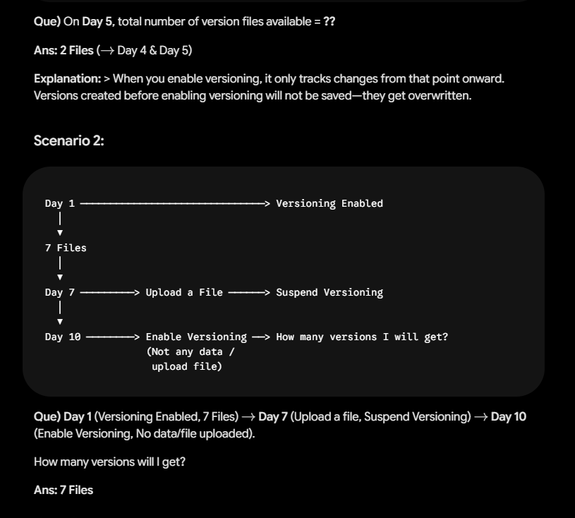


---

## **Page: 6**

* **Note:** Object existing before enabling versioning will have a Version ID as **'null'**.

---

### **Interview Question**

#### **Scenario 1:**

```
[TG Company] ───> Developer 👤 ───> Code ───> Daily Update
                                               │
                                               ├── Day 1 ──┐
                                               ├── Day 2   │ ✖ Old Version Not Maintain 
                                               ├── Day 3   │   (File overwrite)
                                               └── Day 4 ──┘
                                                    │
                      ┌─────────────────────────────┴─────────────────────────────┐
                      ▼                                                           ▼
         Versioning Not Enabled ✖                                   Versioning Enabled  
                      │                                                           │
                      └─────────────────────────────┬─────────────────────────────┘
                                                    │
                                                    ▼
                                                  Day 5 ──> ??

```

**Que)** On **Day 5**, total number of version files available = **??**

**Ans: 2 Files** ($\rightarrow$ Day 4 & Day 5)

> **Explanation:** > When you enable versioning, it only tracks changes from that point onward. Versions created before enabling versioning will not be saved—they get overwritten.

---

#### **Scenario 2:**

```
Day 1 ───────────────────────────────> Versioning Enabled
  │
  ▼
7 Files
  │
  ▼
Day 7 ─────────> Upload a File ──────> Suspend Versioning
  │
  ▼
Day 10 ────────> Enable Versioning ──> How many versions I will get?
                 (Not any data / 
                  upload file)

```

**Que)** **Day 1** (Versioning Enabled, 7 Files) $\rightarrow$ **Day 7** (Upload a file, Suspend Versioning) $\rightarrow$ **Day 10** (Enable Versioning, No data/file uploaded).

How many versions will I get?

**Ans: 7 Files**


-----------------------xxxxxxxxxxxxxxxxxxxx---------------------


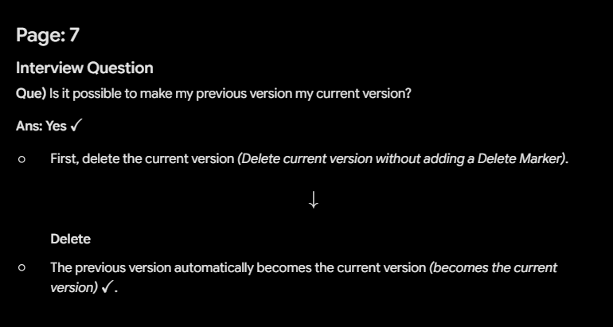


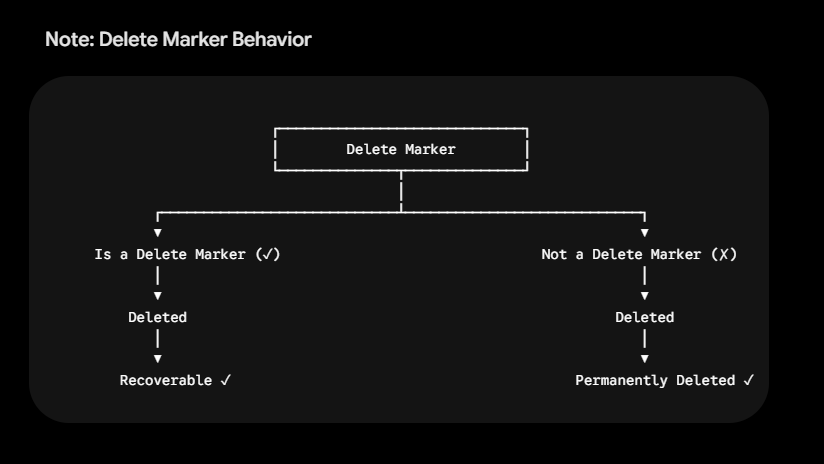


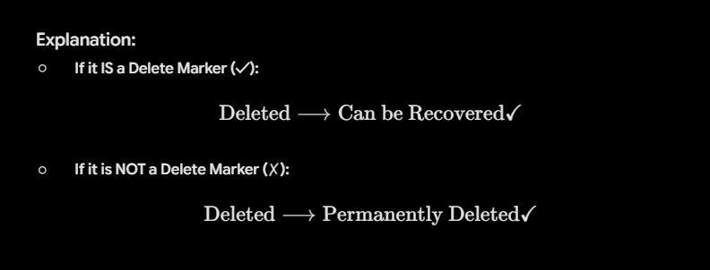


---

## **Page: 7**

### **Interview Question**

**Que)** Is it possible to make my previous version my current version?

**Ans: Yes** $\checkmark$

* First, delete the current version *(Delete current version without adding a Delete Marker)*.

$$\downarrow$$


**Delete**
* The previous version automatically becomes the current version *(becomes the current version)* $\checkmark$.

---

### **Note: Delete Marker Behavior**

```
                         ┌─────────────────────────────┐
                         │        Delete Marker        │
                         └──────────────┬──────────────┘
                                        │
           ┌────────────────────────────┴────────────────────────────┐
           ▼                                                         ▼
    Is a Delete Marker (✓)                               Not a Delete Marker (✗)
           │                                                         │
           ▼                                                         ▼
        Deleted                                                   Deleted
           │                                                         │
           ▼                                                         ▼
       Recoverable ✓                                         Permanently Deleted ✓

```

#### **Explanation:**

* **If it IS a Delete Marker (✓):**

$$\text{Deleted} \longrightarrow \text{Can be Recovered} \checkmark$$


* **If it is NOT a Delete Marker (✗):**

$$\text{Deleted} \longrightarrow \text{Permanently Deleted} \checkmark$$


--------------------xxxxxxxxxxxxxxxxxxxxxxxxxx---------------------------


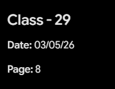


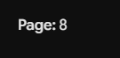


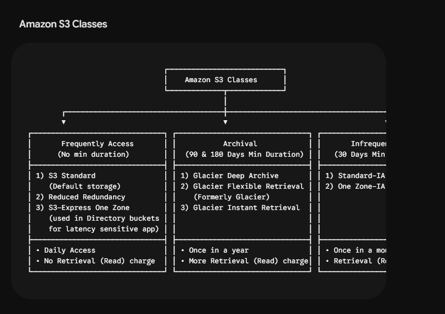


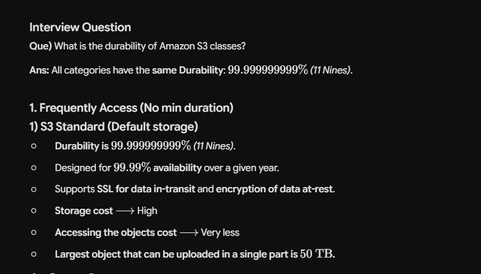


---

## **Class - 29**

**Date:** 03/05/26

**Page:** 8

### **Amazon S3 Classes**

```
                                ┌───────────────────────────┐
                                │    Amazon S3 Classes      │
                                └─────────────┬─────────────┘
                                              │
        ┌─────────────────────────────────────┼─────────────────────────────────────┐
        ▼                                     ▼                                     ▼
┌───────────────────────────────┐ ┌───────────────────────────────┐ ┌───────────────────────────────┐
│       Frequently Access       │ │           Archival            │ │       Infrequent Access       │
│      (No min duration)        │ │  (90 & 180 Days Min Duration) │ │   (30 Days Min Duration)      │
├───────────────────────────────┤ ├───────────────────────────────┤ ├───────────────────────────────┤
│ 1) S3 Standard                │ │ 1) Glacier Deep Archive       │ │ 1) Standard-IA                │
│    (Default storage)          │ │ 2) Glacier Flexible Retrieval │ │ 2) One Zone-IA                │
│ 2) Reduced Redundancy         │ │    (Formerly Glacier)         │ │                               │
│ 3) S3-Express One Zone        │ │ 3) Glacier Instant Retrieval  │ │                               │
│    (used in Directory buckets │ │                               │ │                               │
│    for latency sensitive app) │ │                               │ │                               │
├───────────────────────────────┤ ├───────────────────────────────┤ ├───────────────────────────────┤
│ • Daily Access                │ │ • Once in a year              │ │ • Once in a month             │
│ • No Retrieval (Read) charge  │ │ • More Retrieval (Read) charge│ │ • Retrieval (Read) charge     │
└───────────────────────────────┘ └───────────────────────────────┘ └───────────────────────────────┘

```

---

### **Interview Question**

**Que)** What is the durability of Amazon S3 classes?

**Ans:** All categories have the **same Durability**: **$99.999999999\%$** *(11 Nines)*.

---

### **1. Frequently Access (No min duration)**

#### **1) S3 Standard (Default storage)**

* **Durability is $99.999999999\%$** *(11 Nines)*.
* Designed for **$99.99\%$ availability** over a given year.
* Supports **SSL for data in-transit** and **encryption of data at-rest**.
* **Storage cost** $\longrightarrow$ High
* **Accessing the objects cost** $\longrightarrow$ Very less
* **Largest object that can be uploaded in a single part is $50\text{ TB}$.**


---------------xxxxxxxxxxxxxxxxxxxxxxxxxx-------------------------


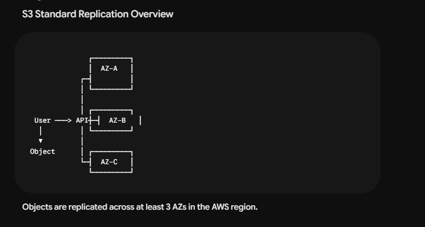


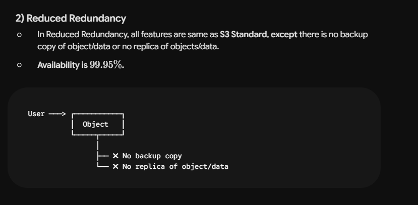


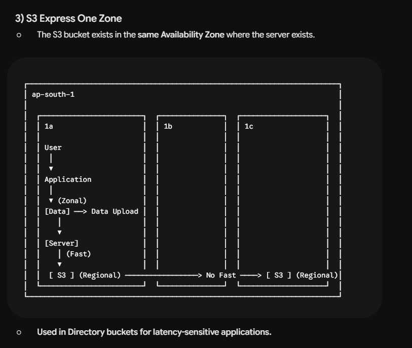

Here is the complete transcript of **Page 9** from your handwritten notes, formatted for clean scannability with translated Hindi notes and structured diagrams.

---

## **Page: 9**

### **S3 Standard Replication Overview**

```
              ┌─────────┐
              │  AZ-A   │
            ┌─┤         │
            │ └─────────┘
            │
            │ ┌─────────┐
 User ───> API┼─┤  AZ-B   │
  │         │ └─────────┘
  ▼         │
Object      │ ┌─────────┐
            └─┤  AZ-C   │
              └─────────┘

```

> **Objects are replicated across at least 3 AZs in the AWS region.**

---

### **2) Reduced Redundancy**

* In Reduced Redundancy, all features are same as **S3 Standard**, **except** there is no backup copy of object/data or no replica of objects/data.
* **Availability is $99.95\%$.**

```
 User ───> ┌───────────┐
           │  Object   │
           └─────┬─────┘
                 │
                 ├── ✖ No backup copy
                 └── ✖ No replica of object/data

```

---

### **3) S3 Express One Zone**

* The S3 bucket exists in the **same Availability Zone** where the server exists.

```
┌─────────────────────────────────────────────────────────────────────────┐
│ ap-south-1                                                              │
│                                                                         │
│  ┌────────────────────────┐  ┌───────────────┐  ┌────────────────────┐  │
│  │ 1a                     │  │ 1b            │  │ 1c                 │  │
│  │                        │  │               │  │                    │  │
│  │ User                   │  │               │  │                    │  │
│  │  │                     │  │               │  │                    │  │
│  │  ▼                     │  │               │  │                    │  │
│  │ Application            │  │               │  │                    │  │
│  │  │                     │  │               │  │                    │  │
│  │  ▼ (Zonal)             │  │               │  │                    │  │
│  │ [Data] ──> Data Upload │  │               │  │                    │  │
│  │    │                   │  │               │  │                    │  │
│  │    ▼                   │  │               │  │                    │  │
│  │ [Server]               │  │               │  │                    │  │
│  │    │ (Fast)            │  │               │  │                    │  │
│  │    ▼                   │  │               │  │                    │  │
│  │  [ S3 ] (Regional) ─────────────────> No Fast ────> [ S3 ] (Regional)│
│  └────────────────────────┘  └───────────────┘  └────────────────────┘  │
└─────────────────────────────────────────────────────────────────────────┘

```

* **Used in Directory buckets for latency-sensitive applications.**


----------------------xxxxxxxxxxxxxxxxxxxxxxxxxx-------------------------


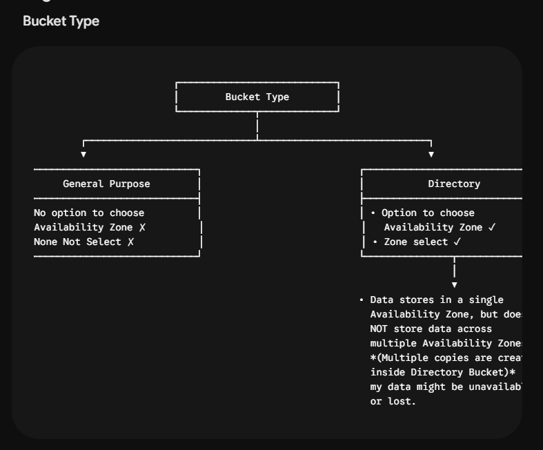


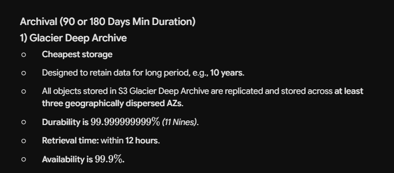


---


## **Page: 10**

### **Bucket Type**

```
                            ┌───────────────────────────┐
                            │        Bucket Type        │
                            └─────────────┬─────────────┘
                                          │
            ┌─────────────────────────────┴─────────────────────────────┐
            ▼                                                           ▼
┌───────────────────────────────┐                           ┌───────────────────────────────┐
│        General Purpose        │                           │           Directory           │
├───────────────────────────────┤                           ├───────────────────────────────┤
│ • No option to choose         │                           │ • Option to choose            │
│   Availability Zone ✗         │                           │   Availability Zone ✓         │
│ • None Not Select ✗           │                           │ • Zone select ✓               │
└───────────────────────────────┘                           └───────────────┬───────────────┘
                                                                            │
                                                                            ▼
                                                            • Data stores in a single       
                                                              Availability Zone, but does   
                                                              NOT store data across         
                                                              multiple Availability Zones.  
                                                              *(Multiple copies are created │
                                                              inside Directory Bucket)* • Availability Zone outage/down,│
                                                              my data might be unavailable  │
                                                              or lost.                      │

```

---

### **Archival (90 or 180 Days Min Duration)**

#### **1) Glacier Deep Archive**

* **Cheapest storage**
* Designed to retain data for long period, e.g., **10 years**.
* All objects stored in S3 Glacier Deep Archive are replicated and stored across **at least three geographically dispersed AZs**.
* **Durability is $99.999999999\%$** *(11 Nines)*.
* **Retrieval time:** within **12 hours**.
* **Availability is $99.9\%$.**


--------------------------xxxxxxxxxxxxxxxxxxxxx---------------------


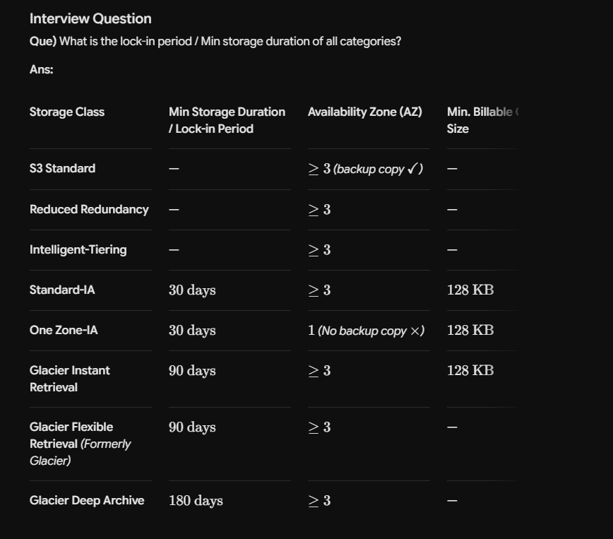


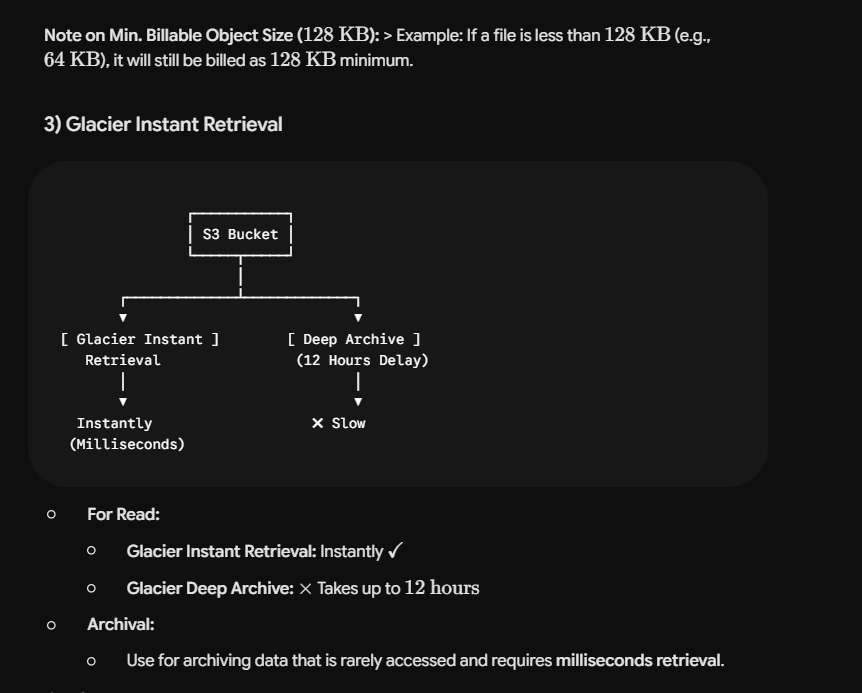


---


## **Page: 11**

### **Interview Question**

**Que)** What is the lock-in period / Min storage duration of all categories?

**Ans:**

| **Storage Class** | **Min Storage Duration / Lock-in Period** | **Availability Zone (AZ)** | **Min. Billable Object Size** |
| --- | --- | --- | --- |
| **S3 Standard** | — | $\ge 3$ *(backup copy $\checkmark$)* | — |
| **Reduced Redundancy** | — | $\ge 3$ | — |
| **Intelligent-Tiering** | — | $\ge 3$ | — |
| **Standard-IA** | $30\text{ days}$ | $\ge 3$ | $128\text{ KB}$ |
| **One Zone-IA** | $30\text{ days}$ | $1$ *(No backup copy $\mathbf{\times}$)* | $128\text{ KB}$ |
| **Glacier Instant Retrieval** | $90\text{ days}$ | $\ge 3$ | $128\text{ KB}$ |
| **Glacier Flexible Retrieval** *(Formerly Glacier)* | $90\text{ days}$ | $\ge 3$ | — |
| **Glacier Deep Archive** | $180\text{ days}$ | $\ge 3$ | — |

> **Note on Min. Billable Object Size ($128\text{ KB}$):** > Example: If a file is less than $128\text{ KB}$ (e.g., $64\text{ KB}$), it will still be billed as $128\text{ KB}$ minimum.

---

### **3) Glacier Instant Retrieval**

```
               ┌───────────┐
               │ S3 Bucket │
               └─────┬─────┘
                     │
       ┌─────────────┴─────────────┐
       ▼                           ▼
[ Glacier Instant ]        [ Deep Archive ]
   Retrieval                (12 Hours Delay)
       │                           │
       ▼                           ▼
  Instantly                   ✖ Slow
 (Milliseconds)

```

* **For Read:**
* **Glacier Instant Retrieval:** Instantly $\checkmark$
* **Glacier Deep Archive:** $\mathbf{\times}$ Takes up to $12\text{ hours}$


* **Archival:**
* Use for archiving data that is rarely accessed and requires **milliseconds retrieval**.


--------------------xxxxxxxxxxxxxxxxxxxxx-------------------


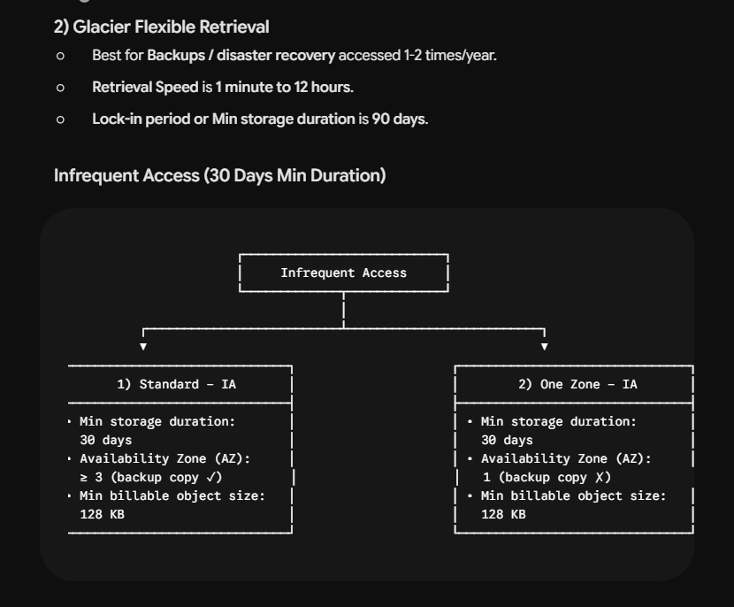


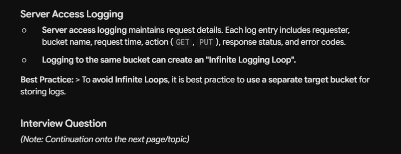


---

## **Page: 12**

### **2) Glacier Flexible Retrieval**

* Best for **Backups / disaster recovery** accessed 1-2 times/year.
* **Retrieval Speed** is **1 minute to 12 hours**.
* **Lock-in period or Min storage duration** is **90 days**.

---

### **Infrequent Access (30 Days Min Duration)**

```
                         ┌───────────────────────────┐
                         │     Infrequent Access     │
                         └─────────────┬─────────────┘
                                       │
            ┌──────────────────────────┴──────────────────────────┐
            ▼                                                     ▼
┌───────────────────────────────┐                     ┌───────────────────────────────┐
│        1) Standard - IA       │                     │        2) One Zone - IA       │
├───────────────────────────────┤                     ├───────────────────────────────┤
│ • Min storage duration:       │                     │ • Min storage duration:       │
│   30 days                     │                     │   30 days                     │
│ • Availability Zone (AZ):     │                     │ • Availability Zone (AZ):     │
│   ≥ 3 (backup copy ✓)         │                     │   1 (backup copy ✗)           │
│ • Min billable object size:   │                     │ • Min billable object size:   │
│   128 KB                      │                     │   128 KB                      │
└───────────────────────────────┘                     └───────────────────────────────┘

```

---

### **Server Access Logging**

* **Server access logging** maintains request details. Each log entry includes requester, bucket name, request time, action (`GET`, `PUT`), response status, and error codes.
* **Logging to the same bucket can create an "Infinite Logging Loop".**

> **Best Practice:** > To **avoid Infinite Loops**, it is best practice to **use a separate target bucket** for storing logs.

---

### **Interview Question**

*(Note: Continuation onto the next page/topic)*


-------------------------xxxxxxxxxxxxxxxxxxxxxx------------------------


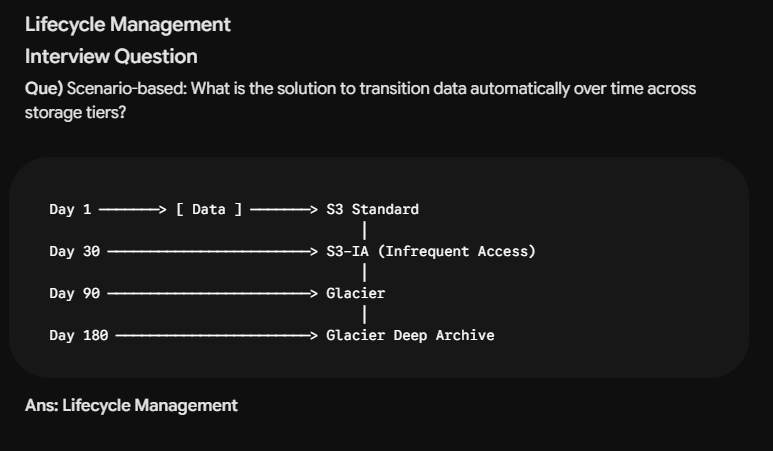


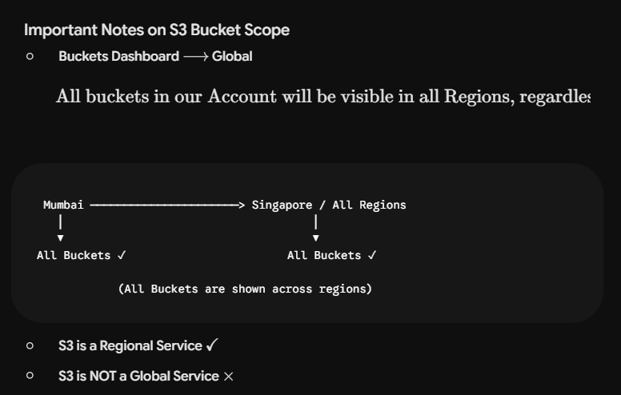


---

## **Page: 13**

### **Lifecycle Management**

#### **Interview Question**

**Que)** Scenario-based: What is the solution to transition data automatically over time across storage tiers?

```
 Day 1 ───────> [ Data ] ───────> S3 Standard
                                      │
 Day 30 ────────────────────────> S3-IA (Infrequent Access)
                                      │
 Day 90 ────────────────────────> Glacier
                                      │
 Day 180 ───────────────────────> Glacier Deep Archive

```

**Ans: Lifecycle Management**

---

### **Important Notes on S3 Bucket Scope**

* **Buckets Dashboard $\longrightarrow$ Global**

$$\text{All buckets in our Account will be visible in all Regions, regardless of where they were created.}$$


```
 Mumbai ──────────────────────> Singapore / All Regions
   │                                     │
   ▼                                     ▼
All Buckets ✓                        All Buckets ✓

            (All Buckets are shown across regions)

```

* **S3 is a Regional Service** $\checkmark$
* **S3 is NOT a Global Service** $\mathbf{\times}$


----------------xxxxxxxxxxxxxxxxxxxx--------------------


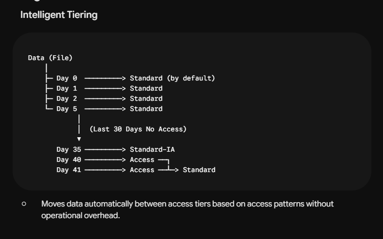


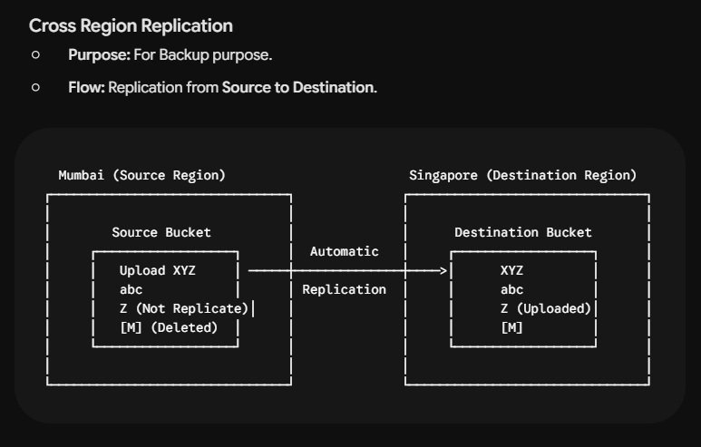


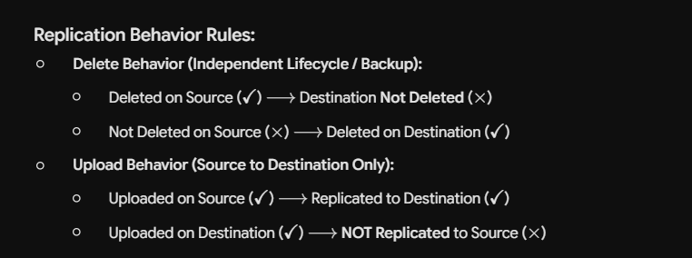


---

## **Page: 14**

### **Intelligent Tiering**

```
Data (File)
    │
    ├─ Day 0  ─────────> Standard (by default)
    ├─ Day 1  ─────────> Standard
    ├─ Day 2  ─────────> Standard
    └─ Day 5  ─────────> Standard
            │
            │  (Last 30 Days No Access)
            ▼
       Day 35 ─────────> Standard-IA
       Day 40 ─────────> Access ──┐
       Day 41 ─────────> Access ──┴─> Standard

```

* Moves data automatically between access tiers based on access patterns without operational overhead.

---

### **Cross Region Replication**

* **Purpose:** For Backup purpose.
* **Flow:** Replication from **Source to Destination**.

```
  Mumbai (Source Region)                        Singapore (Destination Region)
┌───────────────────────────────┐              ┌───────────────────────────────┐
│                               │              │                               │
│        Source Bucket          │              │      Destination Bucket       │
│     ┌──────────────────┐      │  Automatic   │     ┌──────────────────┐      │
│     │   Upload XYZ     │ ─────┼──────────────┼────>│      XYZ         │      │
│     │   abc            │      │ Replication  │     │      abc         │      │
│     │   Z (Not Replicate)│    │              │     │      Z (Uploaded)│      │
│     │   [M] (Deleted)  │      │              │     │      [M]         │      │
│     └──────────────────┘      │              │     └──────────────────┘      │
│                               │              │                               │
└───────────────────────────────┘              └───────────────────────────────┘

```

#### **Replication Behavior Rules:**

* **Delete Behavior (Independent Lifecycle / Backup):**
* Deleted on Source ($\checkmark$) $\longrightarrow$ Destination **Not Deleted** ($\mathbf{\times}$)
* Not Deleted on Source ($\mathbf{\times}$) $\longrightarrow$ Deleted on Destination ($\checkmark$)


* **Upload Behavior (Source to Destination Only):**
* Uploaded on Source ($\checkmark$) $\longrightarrow$ Replicated to Destination ($\checkmark$)
* Uploaded on Destination ($\checkmark$) $\longrightarrow$ **NOT Replicated** to Source ($\mathbf{\times}$)


---------------x-----------------------------


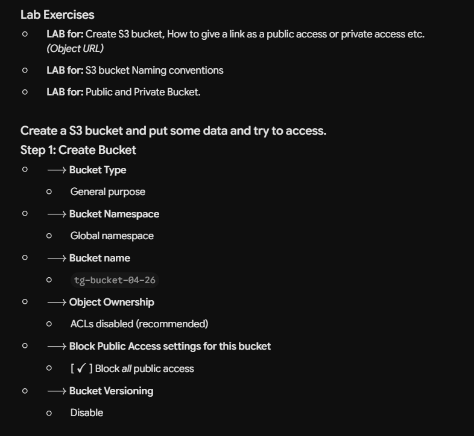


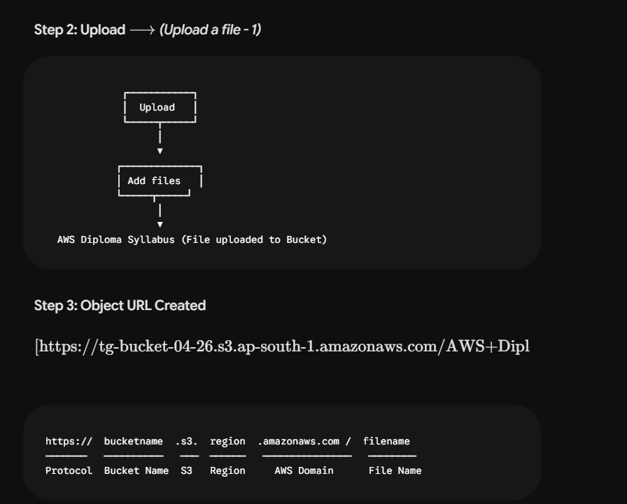


---

## **Page: 15**

### **Lab Exercises**

* **LAB for:** Create S3 bucket, How to give a link as a public access or private access etc. *(Object URL)*
* **LAB for:** S3 bucket Naming conventions
* **LAB for:** Public and Private Bucket.

---

### **Create a S3 bucket and put some data and try to access.**

#### **Step 1: Create Bucket**

* $\longrightarrow$ **Bucket Type**
* General purpose


* $\longrightarrow$ **Bucket Namespace**
* Global namespace


* $\longrightarrow$ **Bucket name**
* `tg-bucket-04-26`


* $\longrightarrow$ **Object Ownership**
* ACLs disabled (recommended)


* $\longrightarrow$ **Block Public Access settings for this bucket**
* [ $\checkmark$ ] Block *all* public access


* $\longrightarrow$ **Bucket Versioning**
* Disable


---

#### **Step 2: Upload** $\longrightarrow$ *(Upload a file - 1)*

```
             ┌───────────┐
             │  Upload   │
             └─────┬─────┘
                   │
                   ▼
            ┌─────────────┐
            │ Add files   │
            └─────┬─────┘
                   │
                   ▼
  AWS Diploma Syllabus (File uploaded to Bucket)

```

---

#### **Step 3: Object URL Created**

$$\text{[https://tg-bucket-04-26.s3.ap-south-1.amazonaws.com/AWS+Diploma+Syllabus.pdf](https://tg-bucket-04-26.s3.ap-south-1.amazonaws.com/AWS+Diploma+Syllabus.pdf)}$$

```
https://  bucketname  .s3.  region  .amazonaws.com /  filename
───────   ──────────   ───  ──────   ───────────────   ────────
Protocol  Bucket Name  S3   Region     AWS Domain      File Name

```


--------------------xxxxxxxxxxxxxxxxxxx---------------------


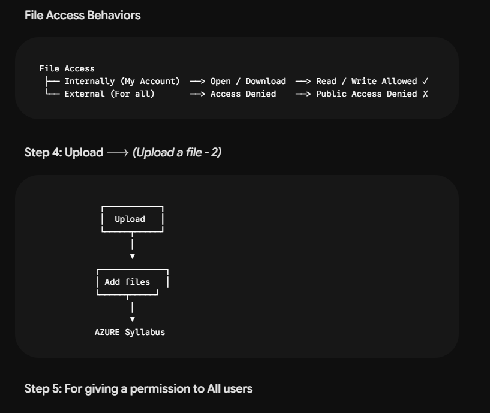


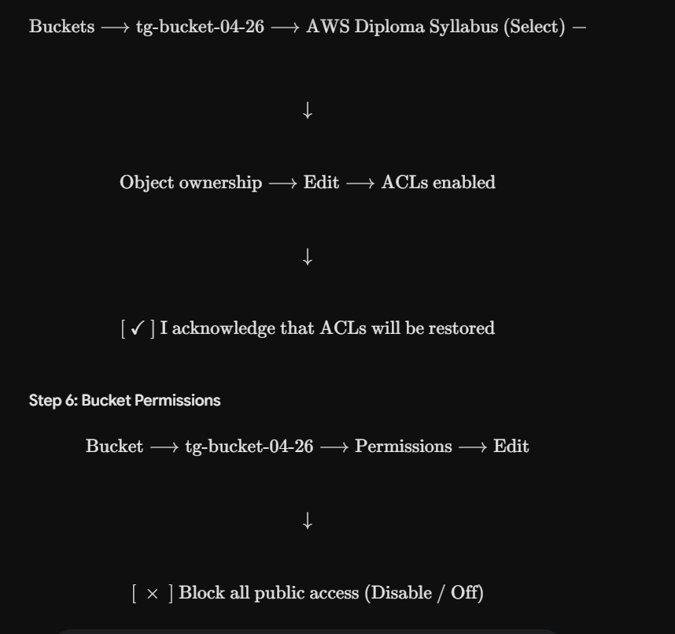


---

## **Page: 16**

### **File Access Behaviors**

```
 File Access
  ├── Internally (My Account)  ──> Open / Download  ──> Read / Write Allowed ✓
  └── External (For all)       ──> Access Denied    ──> Public Access Denied ✗

```

---

### **Step 4: Upload** $\longrightarrow$ *(Upload a file - 2)*

```
             ┌───────────┐
             │  Upload   │
             └─────┬─────┘
                   │
                   ▼
            ┌─────────────┐
            │ Add files   │
            └─────┬─────┘
                   │
                   ▼
            AZURE Syllabus

```

---

### **Step 5: For giving a permission to All users**

$$\text{Buckets} \longrightarrow \text{tg-bucket-04-26} \longrightarrow \text{AWS Diploma Syllabus (Select)} \longrightarrow \text{Permissions}$$

$$\downarrow$$

$$\text{Object ownership} \longrightarrow \text{Edit} \longrightarrow \text{ACLs enabled}$$

$$\downarrow$$

$$\text{[ }\checkmark\text{ ] I acknowledge that ACLs will be restored}$$

---

### **Step 6: Bucket Permissions**

$$\text{Bucket} \longrightarrow \text{tg-bucket-04-26} \longrightarrow \text{Permissions} \longrightarrow \text{Edit}$$

$$\downarrow$$

$$\text{[ }\mathbf{\times}\text{ ] Block all public access (Disable / Off)}$$


-------------------xxxxxxxxxxxxxxxxxxxxxxxx-----------------


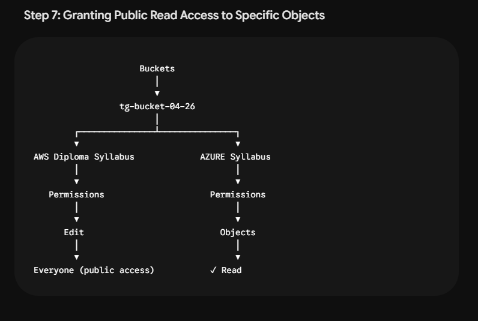


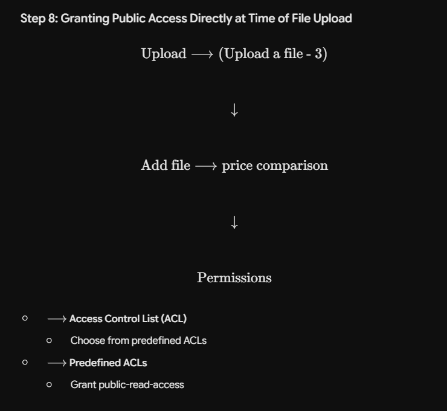


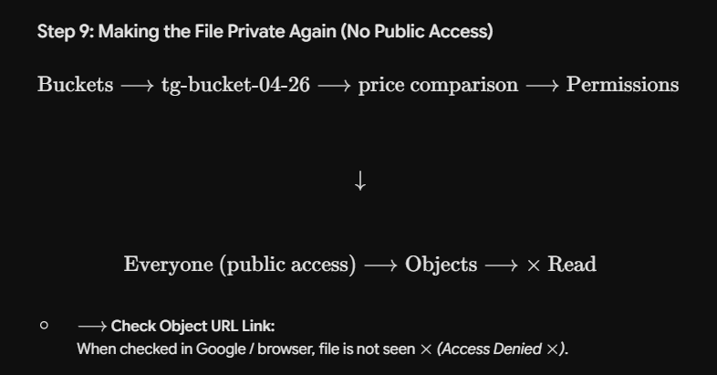


---

## **Page: 17**

### **Step 7: Granting Public Read Access to Specific Objects**

```
                     Buckets
                        │
                        ▼
                 tg-bucket-04-26
                        │
        ┌───────────────┴───────────────┐
        ▼                               ▼
AWS Diploma Syllabus             AZURE Syllabus
        │                               │
        ▼                               ▼
   Permissions                     Permissions
        │                               │
        ▼                               ▼
      Edit                           Objects
        │                               │
        ▼                               ▼
Everyone (public access)           ✓ Read

```

---

### **Step 8: Granting Public Access Directly at Time of File Upload**

$$\text{Upload} \longrightarrow \text{(Upload a file - 3)}$$

$$\downarrow$$

$$\text{Add file} \longrightarrow \text{price comparison}$$

$$\downarrow$$

$$\text{Permissions}$$

* $\longrightarrow$ **Access Control List (ACL)**
* Choose from predefined ACLs


* $\longrightarrow$ **Predefined ACLs**
* Grant public-read-access


---

### **Step 9: Making the File Private Again (No Public Access)**

$$\text{Buckets} \longrightarrow \text{tg-bucket-04-26} \longrightarrow \text{price comparison} \longrightarrow \text{Permissions} \longrightarrow \text{Edit}$$

$$\downarrow$$

$$\text{Everyone (public access)} \longrightarrow \text{Objects} \longrightarrow \mathbf{\times}\text{ Read}$$

---

* $\longrightarrow$ **Check Object URL Link:**
When checked in Google / browser, file is not seen $\mathbf{\times}$ *(Access Denied $\mathbf{\times}$)*.


-------------------xxxxxxxxxxxxxxxxxxxxxxxxx--------------------


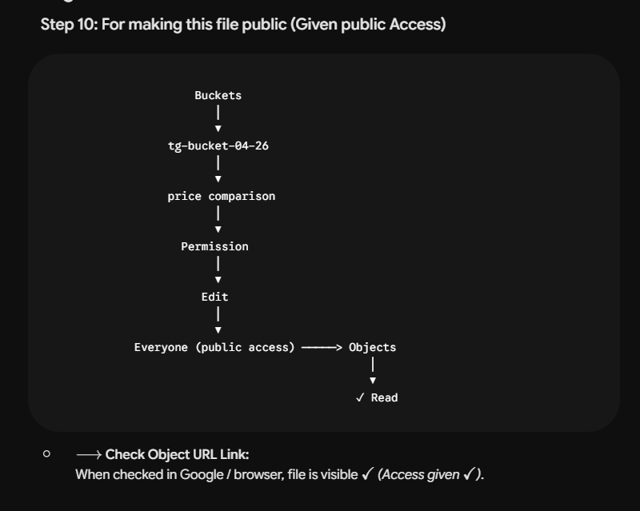


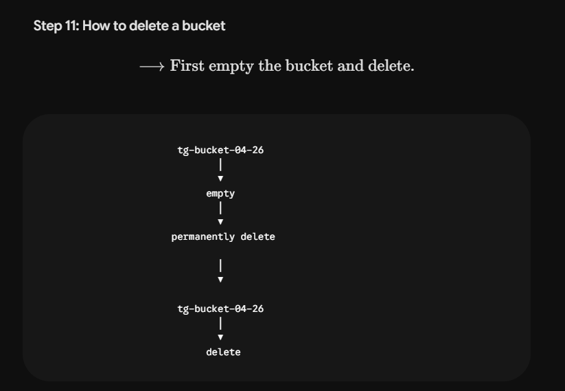


---

## **Page: 18**

### **Step 10: For making this file public (Given public Access)**

```
                     Buckets
                        │
                        ▼
                 tg-bucket-04-26
                        │
                        ▼
                 price comparison
                        │
                        ▼
                   Permission
                        │
                        ▼
                      Edit
                        │
                        ▼
            Everyone (public access) ─────> Objects
                                               │
                                               ▼
                                             ✓ Read

```

* $\longrightarrow$ **Check Object URL Link:**
When checked in Google / browser, file is visible $\checkmark$ *(Access given $\checkmark$)*.

---

### **Step 11: How to delete a bucket**

$$\longrightarrow \text{First empty the bucket and delete.}$$

```
                       tg-bucket-04-26
                              │
                              ▼
                            empty
                              │
                              ▼
                      permanently delete

                              │
                              ▼

                       tg-bucket-04-26
                              │
                              ▼
                            delete

```


------------xxxxxxxxxxxxxxxxxxxxx-------------------


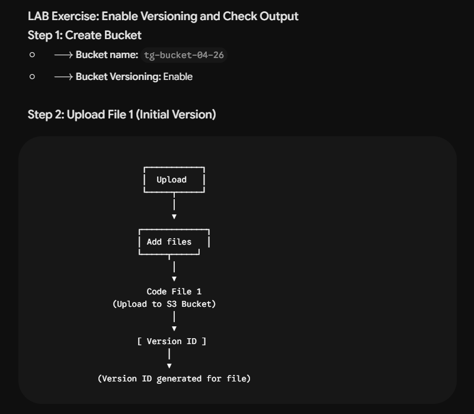


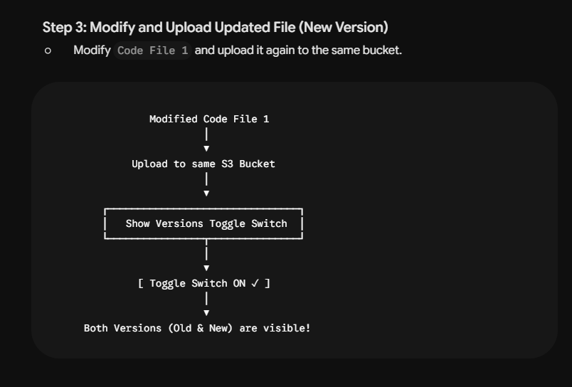


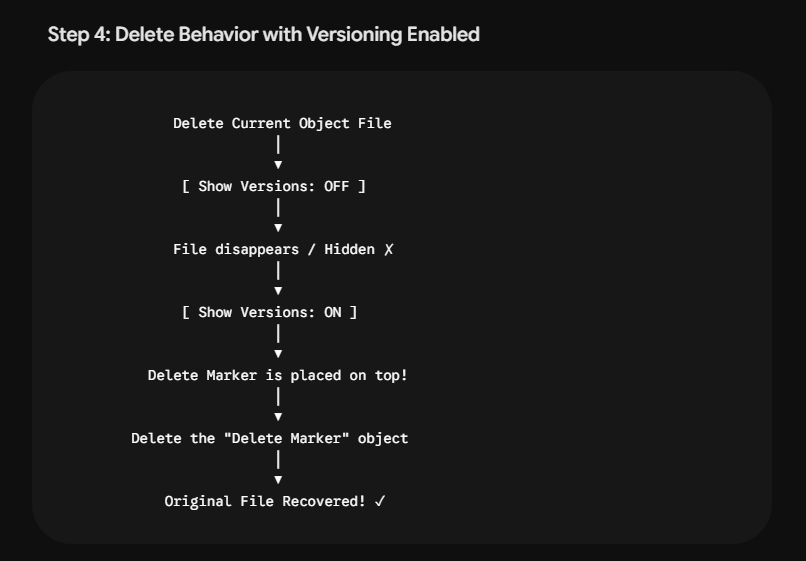


---

## **Page: 19**

### **LAB Exercise: Enable Versioning and Check Output**

#### **Step 1: Create Bucket**

* $\longrightarrow$ **Bucket name:** `tg-bucket-04-26`
* $\longrightarrow$ **Bucket Versioning:** Enable

---

#### **Step 2: Upload File 1 (Initial Version)**

```
                     ┌───────────┐
                     │  Upload   │
                     └─────┬─────┘
                           │
                           ▼
                    ┌─────────────┐
                    │ Add files   │
                    └─────┬─────┘
                           │
                           ▼
                      Code File 1
               (Upload to S3 Bucket)
                           │
                           ▼
                    [ Version ID ]
                          │
                          ▼
            (Version ID generated for file)

```

---

#### **Step 3: Modify and Upload Updated File (New Version)**

* Modify `Code File 1` and upload it again to the same bucket.

```
                Modified Code File 1
                         │
                         ▼
             Upload to same S3 Bucket
                         │
                         ▼
        ┌────────────────────────────────┐
        │   Show Versions Toggle Switch  │
        └────────────────┬───────────────┘
                         │
                         ▼
              [ Toggle Switch ON ✓ ]
                         │
                         ▼
     Both Versions (Old & New) are visible!

```

---

#### **Step 4: Delete Behavior with Versioning Enabled**

```
             Delete Current Object File
                         │
                         ▼
              [ Show Versions: OFF ]
                         │
                         ▼
             File disappears / Hidden ✗
                         │
                         ▼
              [ Show Versions: ON ]
                         │
                         ▼
          Delete Marker is placed on top!
                         │
                         ▼
        Delete the "Delete Marker" object
                         │
                         ▼
            Original File Recovered! ✓

```


---------------------xxxxxxxxxxxxxxxxxxxxx-----------------


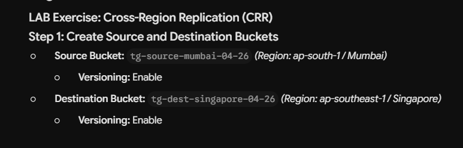


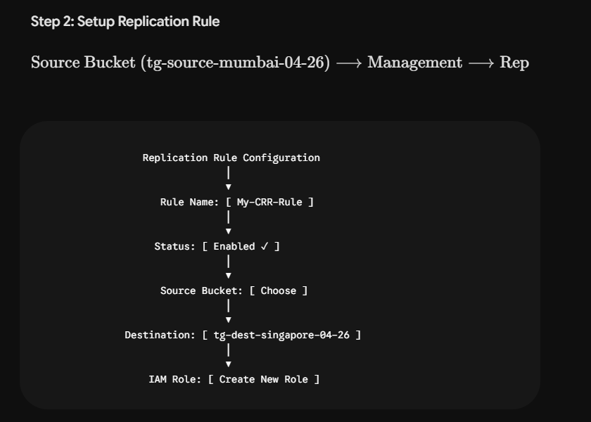


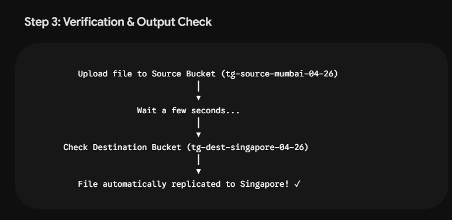


---

## **Page: 20**

### **LAB Exercise: Cross-Region Replication (CRR)**

#### **Step 1: Create Source and Destination Buckets**

* **Source Bucket:** `tg-source-mumbai-04-26` *(Region: ap-south-1 / Mumbai)*
* **Versioning:** Enable


* **Destination Bucket:** `tg-dest-singapore-04-26` *(Region: ap-southeast-1 / Singapore)*
* **Versioning:** Enable


---

#### **Step 2: Setup Replication Rule**

$$\text{Source Bucket (tg-source-mumbai-04-26)} \longrightarrow \text{Management} \longrightarrow \text{Replication rules} \longrightarrow \text{Create replication rule}$$

```
                 Replication Rule Configuration
                               │
                               ▼
                    Rule Name: [ My-CRR-Rule ]
                               │
                               ▼
                   Status: [ Enabled ✓ ]
                               │
                               ▼
                    Source Bucket: [ Choose ]
                               │
                               ▼
              Destination: [ tg-dest-singapore-04-26 ]
                               │
                               ▼
                  IAM Role: [ Create New Role ]

```

---

#### **Step 3: Verification & Output Check**

```
         Upload file to Source Bucket (tg-source-mumbai-04-26)
                                 │
                                 ▼
                     Wait a few seconds...
                                 │
                                 ▼
      Check Destination Bucket (tg-dest-singapore-04-26)
                                 │
                                 ▼
         File automatically replicated to Singapore! ✓

```


-----------------------xxxxxxxxxxxxxxxxxxxxx--------------------


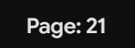


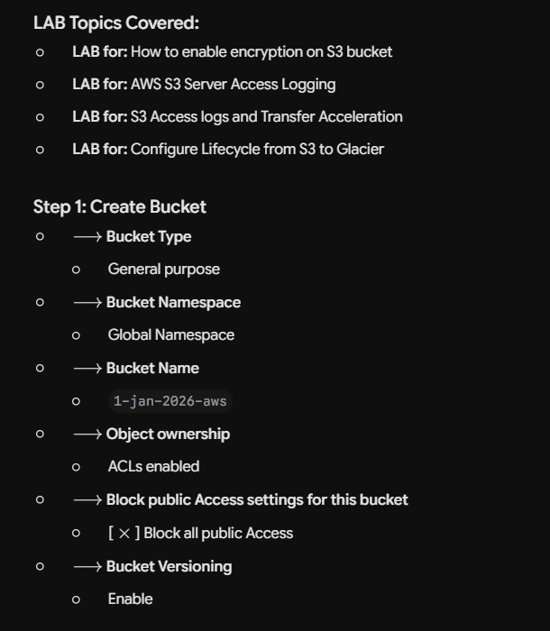


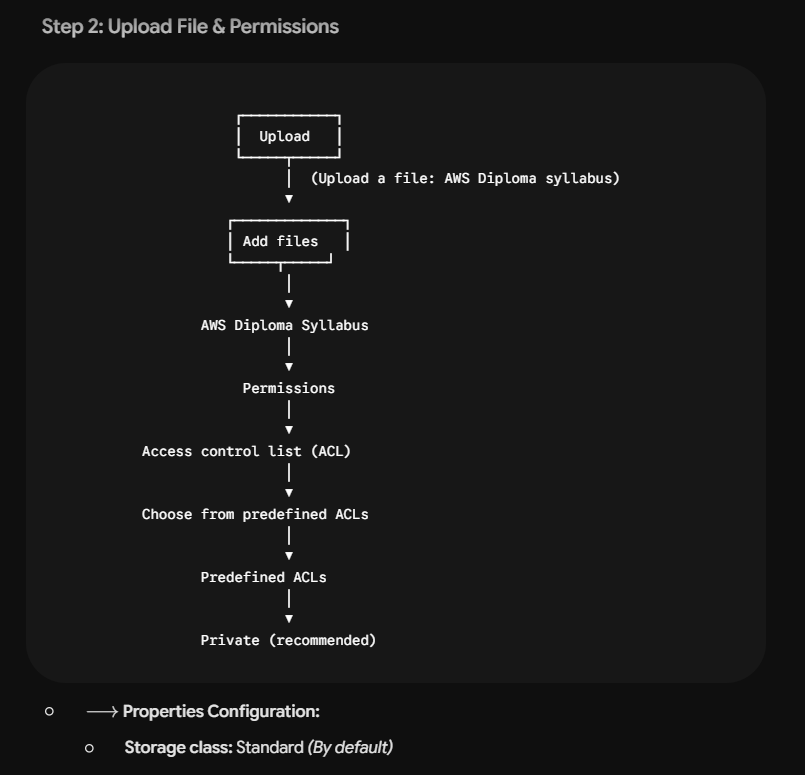


---

## **Page: 21**

### **LAB Topics Covered:**

* **LAB for:** How to enable encryption on S3 bucket
* **LAB for:** AWS S3 Server Access Logging
* **LAB for:** S3 Access logs and Transfer Acceleration
* **LAB for:** Configure Lifecycle from S3 to Glacier

---

#### **Step 1: Create Bucket**

* $\longrightarrow$ **Bucket Type**
* General purpose


* $\longrightarrow$ **Bucket Namespace**
* Global Namespace


* $\longrightarrow$ **Bucket Name**
* `1-jan-2026-aws`


* $\longrightarrow$ **Object ownership**
* ACLs enabled


* $\longrightarrow$ **Block public Access settings for this bucket**
* [ $\mathbf{\times}$ ] Block all public Access


* $\longrightarrow$ **Bucket Versioning**
* Enable


---

#### **Step 2: Upload File & Permissions**

```
                     ┌───────────┐
                     │  Upload   │
                     └─────┬─────┘
                           │  (Upload a file: AWS Diploma syllabus)
                           ▼
                    ┌─────────────┐
                    │ Add files   │
                    └─────┬─────┘
                           │
                           ▼
                 AWS Diploma Syllabus
                           │
                           ▼
                      Permissions
                           │
                           ▼
          Access control list (ACL)
                           │
                           ▼
          Choose from predefined ACLs
                           │
                           ▼
                 Predefined ACLs
                           │
                           ▼
                 Private (recommended)

```

---

* $\longrightarrow$ **Properties Configuration:**
* **Storage class:** Standard *(By default)*


------------------xxxxxxxxxxxxxxxxxx----------------------


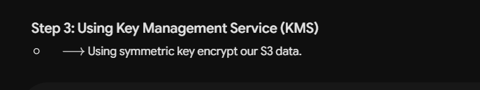


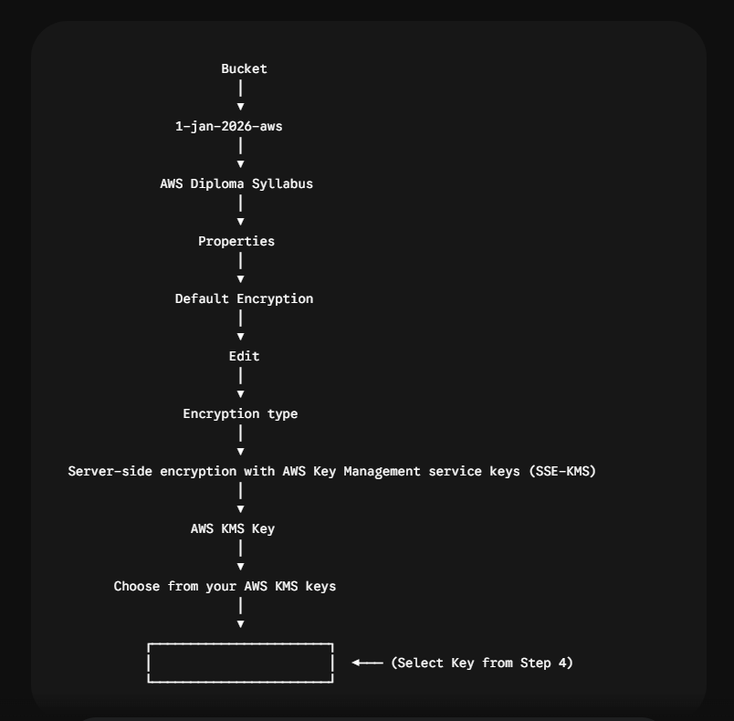


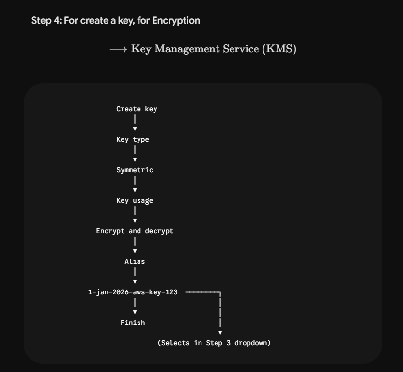


---

## **Page: 22**

#### **Step 3: Using Key Management Service (KMS)**

* $\longrightarrow$ Using symmetric key encrypt our S3 data.

```
                     Bucket
                       │
                       ▼
               1-jan-2026-aws
                       │
                       ▼
             AWS Diploma Syllabus
                       │
                       ▼
                  Properties
                       │
                       ▼
               Default Encryption
                       │
                       ▼
                      Edit
                       │
                       ▼
                Encryption type
                       │
                       ▼
 Server-side encryption with AWS Key Management service keys (SSE-KMS)
                       │
                       ▼
                 AWS KMS Key
                       │
                       ▼
       Choose from your AWS KMS keys
                       │
                       ▼
           ┌───────────────────────┐
           │                       │  ◄─── (Select Key from Step 4)
           └───────────────────────┘

```

---

#### **Step 4: For create a key, for Encryption**

$$\longrightarrow \text{Key Management Service (KMS)}$$

```
                   Create key
                       │
                       ▼
                   Key type
                       │
                       ▼
                   Symmetric
                       │
                       ▼
                   Key usage
                       │
                       ▼
              Encrypt and decrypt
                       │
                       ▼
                     Alias
                       │
                       ▼
            1-jan-2026-aws-key-123  ────────┐
                       │                    │
                       ▼                    │
                    Finish                  │
                                            ▼
                             (Selects in Step 3 dropdown)

```


----------------xxxxxxxxxxxxxxxxx----------------------


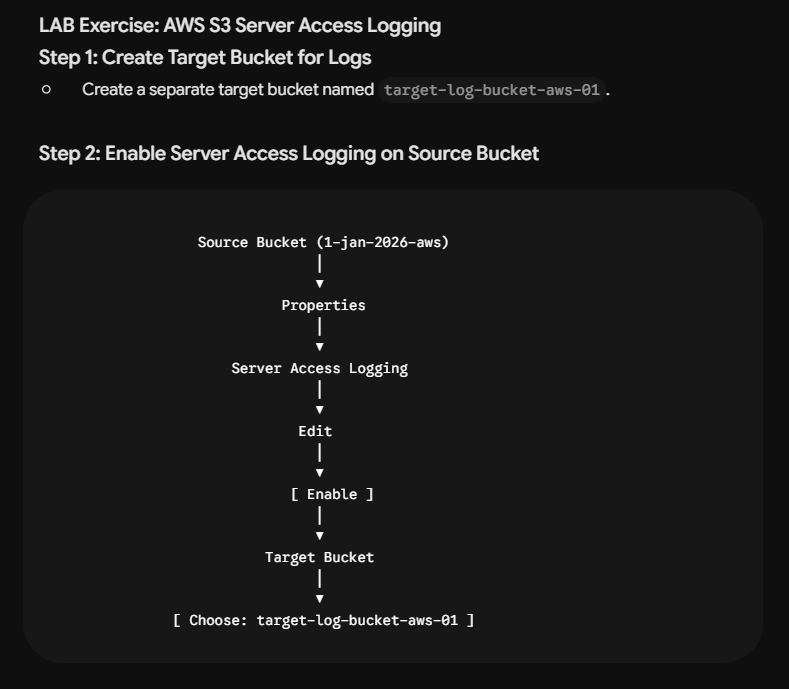


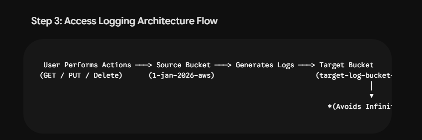


---

## **Page: 23**

### **LAB Exercise: AWS S3 Server Access Logging**

#### **Step 1: Create Target Bucket for Logs**

* Create a separate target bucket named `target-log-bucket-aws-01`.

---

#### **Step 2: Enable Server Access Logging on Source Bucket**

```
                 Source Bucket (1-jan-2026-aws)
                               │
                               ▼
                           Properties
                               │
                               ▼
                     Server Access Logging
                               │
                               ▼
                             Edit
                               │
                               ▼
                            [ Enable ]
                               │
                               ▼
                         Target Bucket
                               │
                               ▼
              [ Choose: target-log-bucket-aws-01 ]

```

---

#### **Step 3: Access Logging Architecture Flow**

```
 User Performs Actions ───> Source Bucket ───> Generates Logs ───> Target Bucket
(GET / PUT / Delete)      (1-jan-2026-aws)                        (target-log-bucket-aws-01)
                                                                               │
                                                                               ▼
                                                                     *(Avoids Infinite Loop)*

```


-------------------------xxxxxxxxxxxxxxxxxxxxxx--------------------


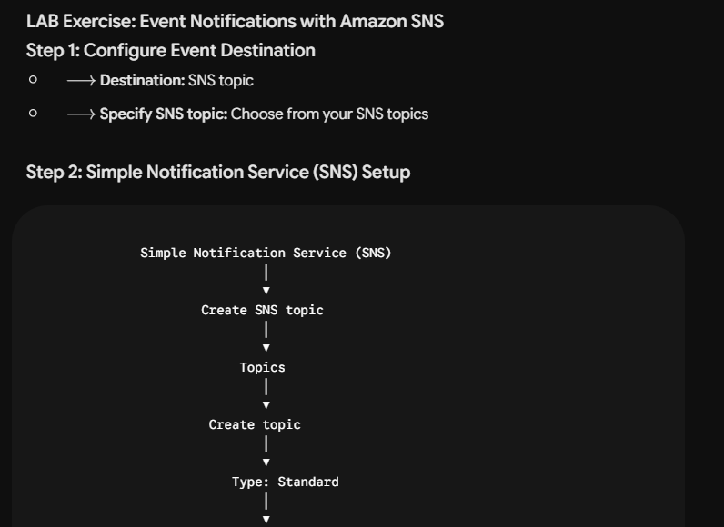


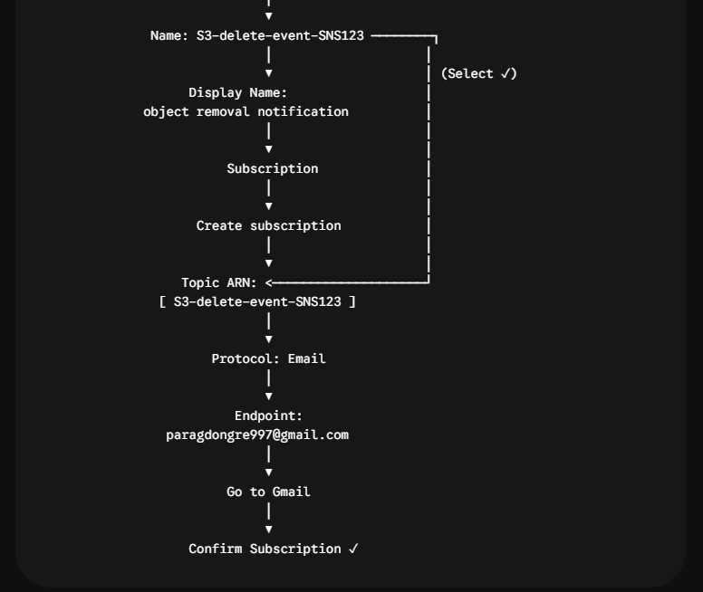


---

## **Page: 24**

### **LAB Exercise: Event Notifications with Amazon SNS**

#### **Step 1: Configure Event Destination**

* $\longrightarrow$ **Destination:** SNS topic
* $\longrightarrow$ **Specify SNS topic:** Choose from your SNS topics

---

#### **Step 2: Simple Notification Service (SNS) Setup**

```
             Simple Notification Service (SNS)
                             │
                             ▼
                     Create SNS topic
                             │
                             ▼
                          Topics
                             │
                             ▼
                      Create topic
                             │
                             ▼
                         Type: Standard
                             │
                             ▼
              Name: S3-delete-event-SNS123 ────────┐
                             │                    │
                             ▼                    │ (Select ✓)
                   Display Name:                  │
             object removal notification          │
                             │                    │
                             ▼                    │
                        Subscription              │
                             │                    │
                             ▼                    │
                    Create subscription           │
                             │                    │
                             ▼                    │
                  Topic ARN: <────────────────────┘
               [ S3-delete-event-SNS123 ]
                             │
                             ▼
                      Protocol: Email
                             │
                             ▼
                         Endpoint:
                paragdongre997@gmail.com
                             │
                             ▼
                        Go to Gmail
                             │
                             ▼
                   Confirm Subscription ✓

```


---------------xxxxxxxxxxxxxxxxxxxxxxxxxxxx-----------------------


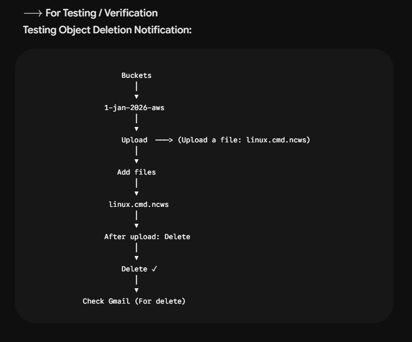


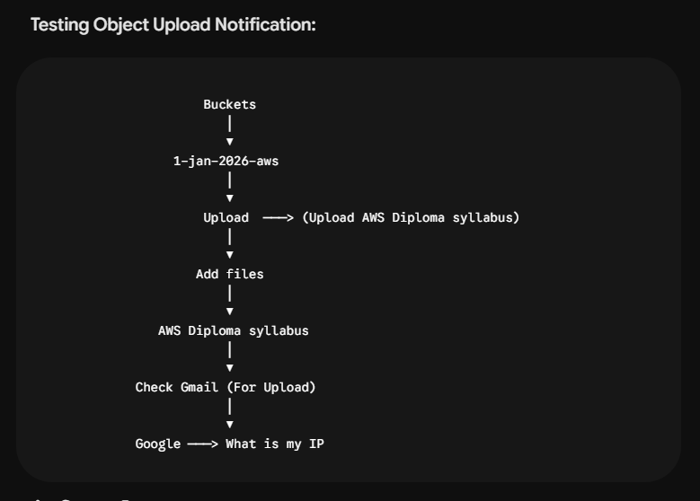


---

## **Page: 25**

### $\longrightarrow$ **For Testing / Verification**

#### **Testing Object Deletion Notification:**

```
                     Buckets
                        │
                        ▼
                 1-jan-2026-aws
                        │
                        ▼
                     Upload  ───> (Upload a file: linux.cmd.ncws)
                        │
                        ▼
                    Add files
                        │
                        ▼
                  linux.cmd.ncws
                        │
                        ▼
                 After upload: Delete
                        │
                        ▼
                     Delete ✓
                        │
                        ▼
            Check Gmail (For delete)

```

---

#### **Testing Object Upload Notification:**

```
                     Buckets
                        │
                        ▼
                 1-jan-2026-aws
                        │
                        ▼
                     Upload  ───> (Upload AWS Diploma syllabus)
                        │
                        ▼
                    Add files
                        │
                        ▼
               AWS Diploma syllabus
                        │
                        ▼
            Check Gmail (For Upload)
                        │
                        ▼
            Google ───> What is my IP

```


------------------xxxxxxxxxxxxxxxxxxxxx-------------------


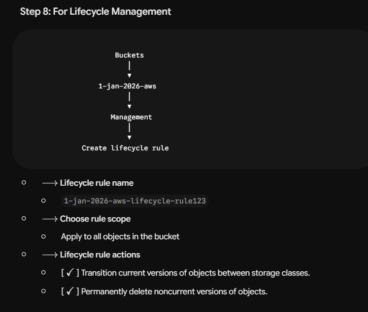


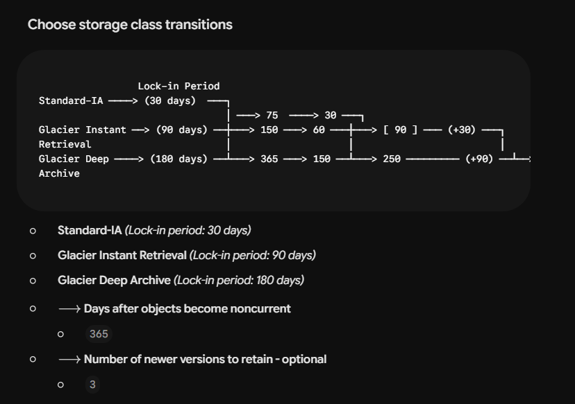


---

## **Page: 26**

### **Step 8: For Lifecycle Management**

```
                     Buckets
                        │
                        ▼
                 1-jan-2026-aws
                        │
                        ▼
                    Management
                        │
                        ▼
             Create lifecycle rule

```

---

* $\longrightarrow$ **Lifecycle rule name**
* `1-jan-2026-aws-lifecycle-rule123`


* $\longrightarrow$ **Choose rule scope**
* Apply to all objects in the bucket


* $\longrightarrow$ **Lifecycle rule actions**
* [ $\mathbf{\checkmark}$ ] Transition current versions of objects between storage classes.
* [ $\mathbf{\checkmark}$ ] Permanently delete noncurrent versions of objects.


---

#### **Choose storage class transitions**

```
                 Lock-in Period
Standard-IA ────> (30 days)  ───┐
                                │ ───> 75  ────> 30 ───┐
Glacier Instant ──> (90 days) ──┼───> 150 ───> 60 ───┼───> [ 90 ] ─── (+30) ───┐
Retrieval                       │                    │                         │
Glacier Deep ────> (180 days) ──┴───> 365 ───> 150 ──┴───> 250 ───────── (+90) ──┴──> [  ]
Archive

```

* **Standard-IA** *(Lock-in period: 30 days)*
* **Glacier Instant Retrieval** *(Lock-in period: 90 days)*
* **Glacier Deep Archive** *(Lock-in period: 180 days)*

---

* $\longrightarrow$ **Days after objects become noncurrent**
* `365`


* $\longrightarrow$ **Number of newer versions to retain - optional**
* `3`


-----------------xxxxxxxxxxxxxxxxxxxxxxxxxx-----------------------


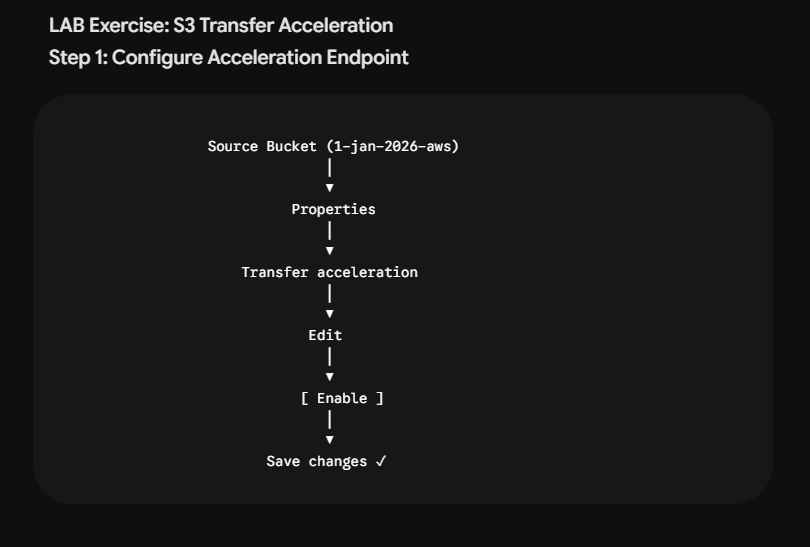


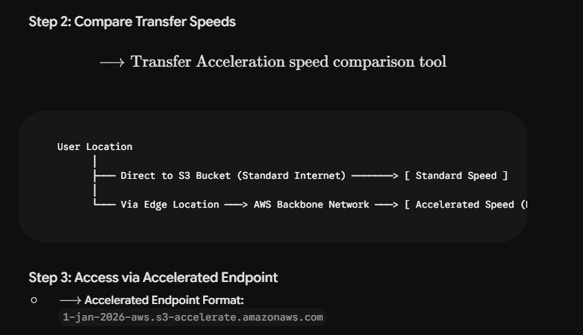


---

## **Page: 27**

### **LAB Exercise: S3 Transfer Acceleration**

#### **Step 1: Configure Acceleration Endpoint**

```
                 Source Bucket (1-jan-2026-aws)
                               │
                               ▼
                           Properties
                               │
                               ▼
                     Transfer acceleration
                               │
                               ▼
                             Edit
                               │
                               ▼
                            [ Enable ]
                               │
                               ▼
                        Save changes ✓

```

---

#### **Step 2: Compare Transfer Speeds**

$$\longrightarrow \text{Transfer Acceleration speed comparison tool}$$

```
   User Location
         │
         ├─── Direct to S3 Bucket (Standard Internet) ───────> [ Standard Speed ]
         │
         └─── Via Edge Location ───> AWS Backbone Network ───> [ Accelerated Speed (Faster) ✓ ]

```

---

#### **Step 3: Access via Accelerated Endpoint**

* $\longrightarrow$ **Accelerated Endpoint Format:**
`1-jan-2026-aws.s3-accelerate.amazonaws.com`


-------------------xxxxxxxxxxxxxxxxxxxx-----------------------


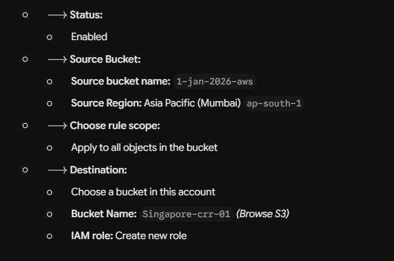


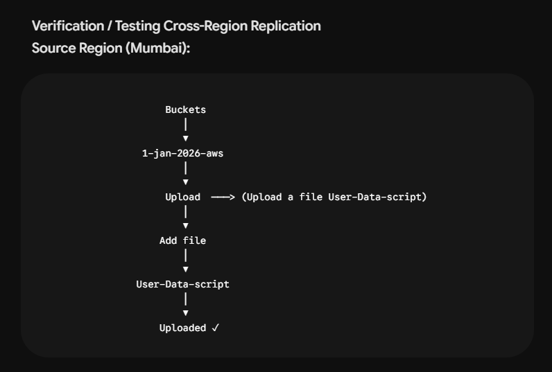


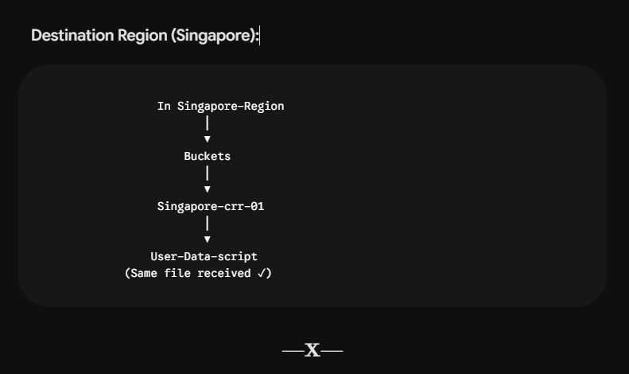


---

## **Page: 28**

* $\longrightarrow$ **Status:**
* Enabled


* $\longrightarrow$ **Source Bucket:**
* **Source bucket name:** `1-jan-2026-aws`
* **Source Region:** Asia Pacific (Mumbai) `ap-south-1`


* $\longrightarrow$ **Choose rule scope:**
* Apply to all objects in the bucket


* $\longrightarrow$ **Destination:**
* Choose a bucket in this account
* **Bucket Name:** `Singapore-crr-01` *(Browse S3)*
* **IAM role:** Create new role


---

### **Verification / Testing Cross-Region Replication**

#### **Source Region (Mumbai):**

```
                     Buckets
                        │
                        ▼
                 1-jan-2026-aws
                        │
                        ▼
                     Upload  ───> (Upload a file User-Data-script)
                        │
                        ▼
                    Add file
                        │
                        ▼
                User-Data-script
                        │
                        ▼
                    Uploaded ✓

```

---

#### **Destination Region (Singapore):**

```
                 In Singapore-Region
                        │
                        ▼
                     Buckets
                        │
                        ▼
                 Singapore-crr-01
                        │
                        ▼
                User-Data-script
            (Same file received ✓)

```

---

$$\mathbf{—\mathbf{X}—}$$


-----------------xxxxxxxxxxxxxxxxxxxx------------------------


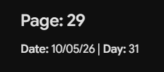


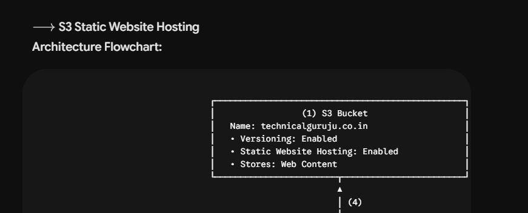


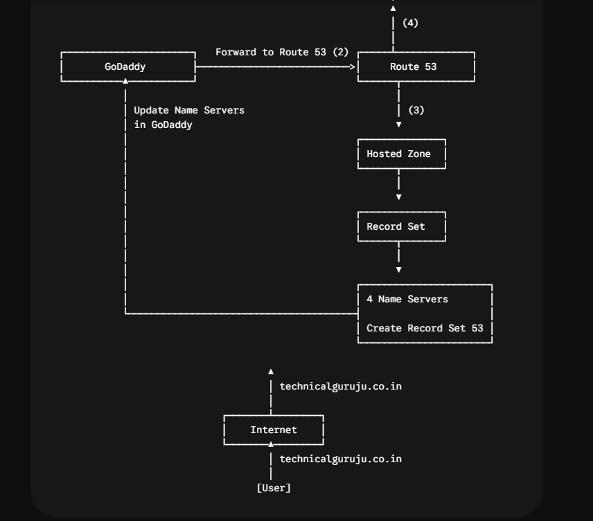


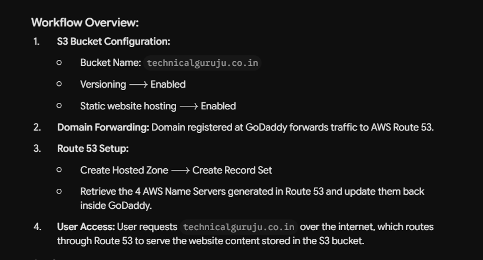


---

## **Page: 29**

**Date:** 10/05/26 | **Day:** 31

### $\longrightarrow$ **S3 Static Website Hosting**

#### **Architecture Flowchart:**

```
                                 ┌─────────────────────────────────────────────────┐
                                 │                 (1) S3 Bucket                   │
                                 │   Name: technicalguruju.co.in                   │
                                 │   • Versioning: Enabled                         │
                                 │   • Static Website Hosting: Enabled             │
                                 │   • Stores: Web Content                         │
                                 └────────────────────────┬────────────────────────┘
                                                          ▲
                                                          │ (4)
                                                          │
 ┌──────────────────────┐   Forward to Route 53 (2) ┌─────┴─────────────┐
 │       GoDaddy        ├──────────────────────────>│     Route 53      │
 └──────────▲───────────┘                           └──────┬────────────┘
            │                                              │
            │ Update Name Servers                          │ (3)
            │ in GoDaddy                                   ▼
            │                                       ┌──────────────┐
            │                                       │ Hosted Zone  │
            │                                       └──────┬───────┘
            │                                              │
            │                                              ▼
            │                                       ┌──────────────┐
            │                                       │ Record Set   │
            │                                       └──────┬───────┘
            │                                              │
            │                                              ▼
            │                                       ┌──────────────────────┐
            │                                       │ 4 Name Servers       │
            └───────────────────────────────────────┤                      │
                                                    │ Create Record Set 53 │
                                                    └──────────────────────┘

                                     ▲
                                     │ technicalguruju.co.in
                                     │
                             ┌───────┴────────┐
                             │    Internet    │
                             └───────▲────────┘
                                     │ technicalguruju.co.in
                                     │
                                   [User]

```

---

#### **Workflow Overview:**

1. **S3 Bucket Configuration:**
* Bucket Name: `technicalguruju.co.in`
* Versioning $\longrightarrow$ Enabled
* Static website hosting $\longrightarrow$ Enabled


2. **Domain Forwarding:** Domain registered at GoDaddy forwards traffic to AWS Route 53.
3. **Route 53 Setup:**
* Create Hosted Zone $\longrightarrow$ Create Record Set
* Retrieve the 4 AWS Name Servers generated in Route 53 and update them back inside GoDaddy.


4. **User Access:** User requests `technicalguruju.co.in` over the internet, which routes through Route 53 to serve the website content stored in the S3 bucket.


-----------------xxxxxxxxxxxxxxxxxx----------------------


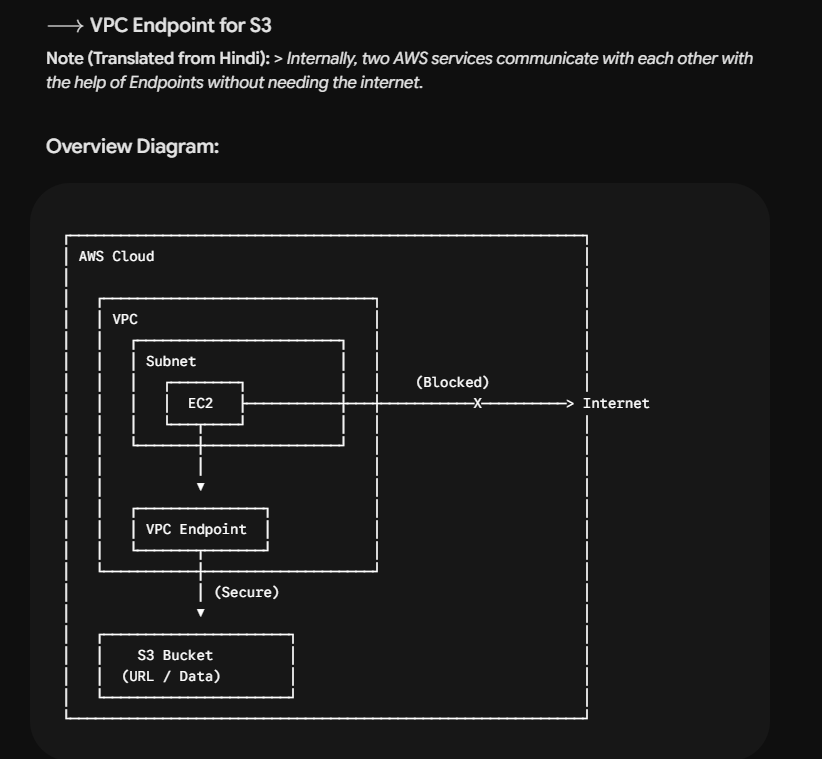


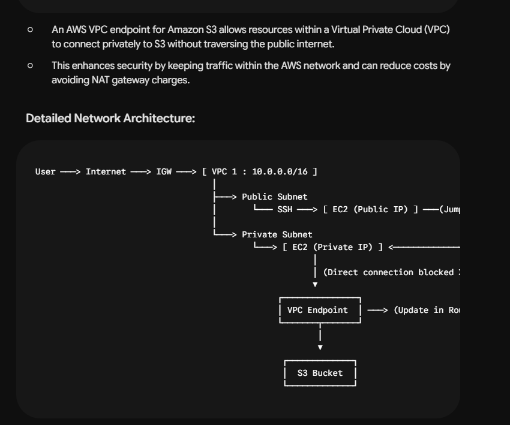


---

## **Page: 30**

### $\longrightarrow$ **VPC Endpoint for S3**

> **Note (Translated from Hindi):** > *Internally, two AWS services communicate with each other with the help of Endpoints without needing the internet.*

#### **Overview Diagram:**

```
┌─────────────────────────────────────────────────────────────┐
│ AWS Cloud                                                   │
│                                                             │
│   ┌────────────────────────────────┐                        │
│   │ VPC                            │                        │
│   │   ┌────────────────────────┐   │                        │
│   │   │ Subnet                 │   │                        │
│   │   │   ┌────────┐           │   │    (Blocked)           │
│   │   │   │  EC2   ├───────────┼───┼───────────X──────────> Internet
│   │   │   └───┬────┘           │   │                        │
│   │   └───────┼────────────────┘   │                        │
│   │           │                    │                        │
│   │           ▼                    │                        │
│   │   ┌───────────────┐            │                        │
│   │   │ VPC Endpoint  │            │                        │
│   │   └───────┬───────┘            │                        │
│   └───────────┼────────────────────┘                        │
│               │ (Secure)                                    │
│               ▼                                             │
│   ┌──────────────────────┐                                  │
│   │    S3 Bucket         │                                  │
│   │  (URL / Data)        │                                  │
│   └──────────────────────┘                                  │
└─────────────────────────────────────────────────────────────┘

```

---

* An AWS VPC endpoint for Amazon S3 allows resources within a Virtual Private Cloud (VPC) to connect privately to S3 without traversing the public internet.
* This enhances security by keeping traffic within the AWS network and can reduce costs by avoiding NAT gateway charges.

---

#### **Detailed Network Architecture:**

```
User ───> Internet ───> IGW ───> [ VPC 1 : 10.0.0.0/16 ]
                                   │
                                   ├───> Public Subnet
                                   │       └─── SSH ───> [ EC2 (Public IP) ] ───(Jump Service)──┐
                                   │                                                            │
                                   └───> Private Subnet                                         │
                                           └───> [ EC2 (Private IP) ] <─────────────────────────┘
                                                       │
                                                       │ (Direct connection blocked X)
                                                       ▼
                                                ┌───────────────┐
                                                │ VPC Endpoint  │ ───> (Update in Route Table)
                                                └───────┬───────┘
                                                        │
                                                        ▼
                                                 ┌─────────────┐
                                                 │  S3 Bucket  │
                                                 └─────────────┘

```


------------------xxxxxxxxxxxxxxxxxxxxx--------------------


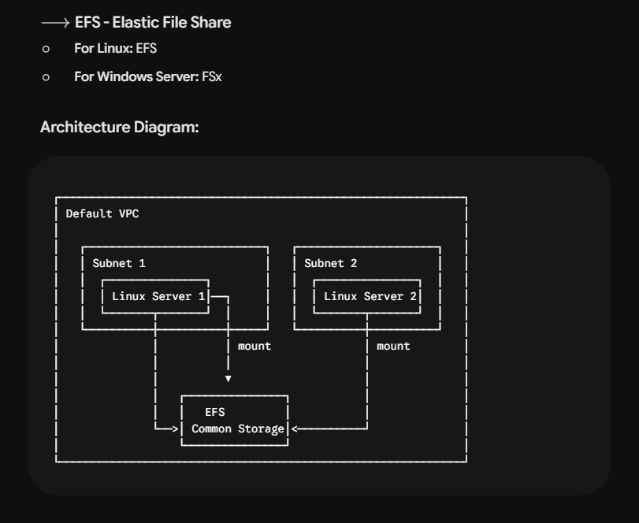


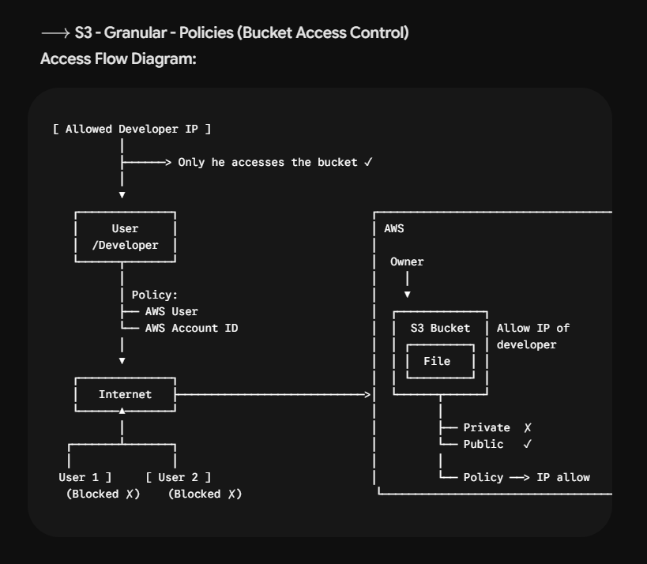


---

## **Page: 31**

### $\longrightarrow$ **EFS - Elastic File Share**

* **For Linux:** EFS
* **For Windows Server:** FSx

#### **Architecture Diagram:**

```
┌─────────────────────────────────────────────────────────────┐
│ Default VPC                                                 │
│                                                             │
│   ┌───────────────────────────┐   ┌─────────────────────┐   │
│   │ Subnet 1                  │   │ Subnet 2            │   │
│   │  ┌───────────────┐        │   │  ┌───────────────┐  │   │
│   │  │ Linux Server 1│──┐     │   │  │ Linux Server 2│  │   │
│   │  └───────┬───────┘  │     │   │  └───────┬───────┘  │   │
│   └──────────┼──────────┼─────┘   └──────────┼──────────┘   │
│              │          │ mount              │ mount        │
│              │          │                    │              │
│              │          ▼                    │              │
│              │   ┌───────────────┐           │              │
│              │   │   EFS         │           │              │
│              └──>│ Common Storage│<──────────┘              │
│                  └───────────────┘                          │
└─────────────────────────────────────────────────────────────┘

```

---

### $\longrightarrow$ **S3 - Granular - Policies (Bucket Access Control)**

#### **Access Flow Diagram:**

```
   [ Allowed Developer IP ]
             │
             ├──────> Only he accesses the bucket ✓
             │
             ▼
      ┌──────────────┐                             ┌───────────────────────────────────────┐
      │     User     │                             │ AWS                                   │
      │  /Developer  │                             │                                       │
      └──────┬───────┘                             │  Owner                                │
             │                                     │    │                                  │
             │ Policy:                             │    ▼                                  │
             ├── AWS User                          │  ┌─────────────┐                      │
             └── AWS Account ID                    │  │  S3 Bucket  │ Allow IP of           │
             │                                     │  │ ┌─────────┐ │ developer            │
             ▼                                     │  │ │  File   │ │                      │
      ┌──────────────┐                             │  │ └─────────┘ │                      │
      │   Internet   ├────────────────────────────>│  └──────┬──────┘                      │
      └──────▲───────┘                             │         │                             │
             │                                     │         ├── Private  ✗                │
     ┌───────┴───────┐                             │         └── Public   ✓                │
     │               │                             │         │                             │
  [ User 1 ]     [ User 2 ]                        │         └── Policy ──> IP allow       │
     (Blocked ✗)    (Blocked ✗)                    └───────────────────────────────────────┘

```

---

#### **Key Components:**

* **Developer Identification:** Policy matches specific AWS User / AWS Account ID / IP Address.
* **Bucket Access Restrictions:**
* **Private:** Disabled
* **Public:** Enabled *(with IP allowance rule)*


* **Policy Rule:** Explicit IP allowance that restricts bucket operations to authorized user IPs while blocking all unauthorized internet requests.


___________________xxxxxxxxxxxxxxxx_________________


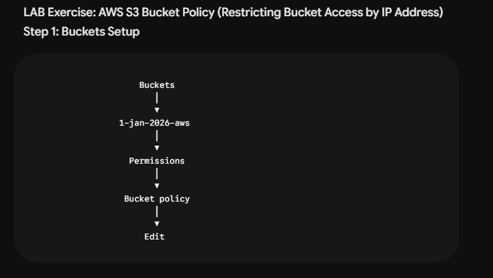


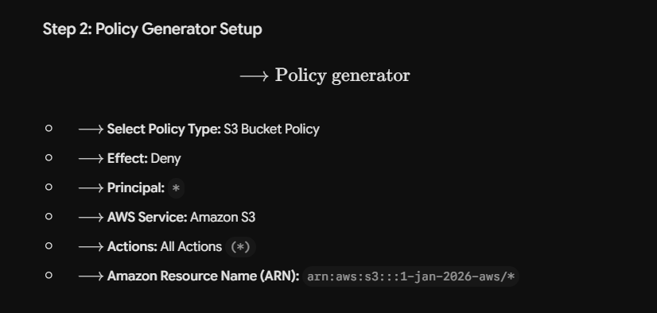


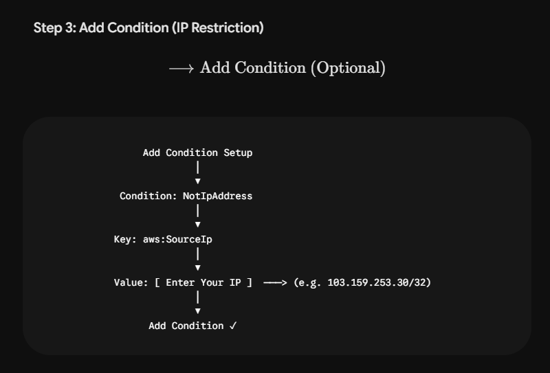


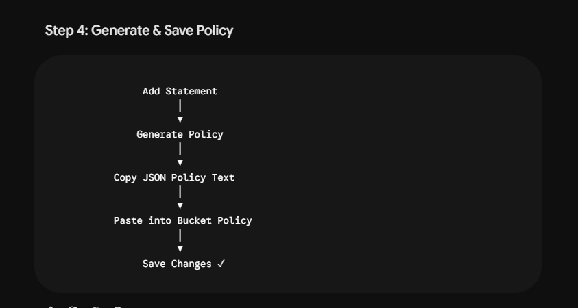


---

## **Page: 32**

### **LAB Exercise: AWS S3 Bucket Policy (Restricting Bucket Access by IP Address)**

#### **Step 1: Buckets Setup**

```
                     Buckets
                        │
                        ▼
                 1-jan-2026-aws
                        │
                        ▼
                   Permissions
                        │
                        ▼
                  Bucket policy
                        │
                        ▼
                      Edit

```

---

#### **Step 2: Policy Generator Setup**

$$\longrightarrow \text{Policy generator}$$

* $\longrightarrow$ **Select Policy Type:** S3 Bucket Policy
* $\longrightarrow$ **Effect:** Deny
* $\longrightarrow$ **Principal:** `*`
* $\longrightarrow$ **AWS Service:** Amazon S3
* $\longrightarrow$ **Actions:** All Actions `(*)`
* $\longrightarrow$ **Amazon Resource Name (ARN):** `arn:aws:s3:::1-jan-2026-aws/*`

---

#### **Step 3: Add Condition (IP Restriction)**

$$\longrightarrow \text{Add Condition (Optional)}$$

```
                 Add Condition Setup
                          │
                          ▼
             Condition: NotIpAddress
                          │
                          ▼
            Key: aws:SourceIp
                          │
                          ▼
            Value: [ Enter Your IP ]  ───> (e.g. 103.159.253.30/32)
                          │
                          ▼
                  Add Condition ✓

```

---

#### **Step 4: Generate & Save Policy**

```
               Add Statement
                     │
                     ▼
              Generate Policy
                     │
                     ▼
          Copy JSON Policy Text
                     │
                     ▼
          Paste into Bucket Policy
                     │
                     ▼
               Save Changes ✓

```


-----------------xxxxxxxxxxxxxxxxxxxx--------------------


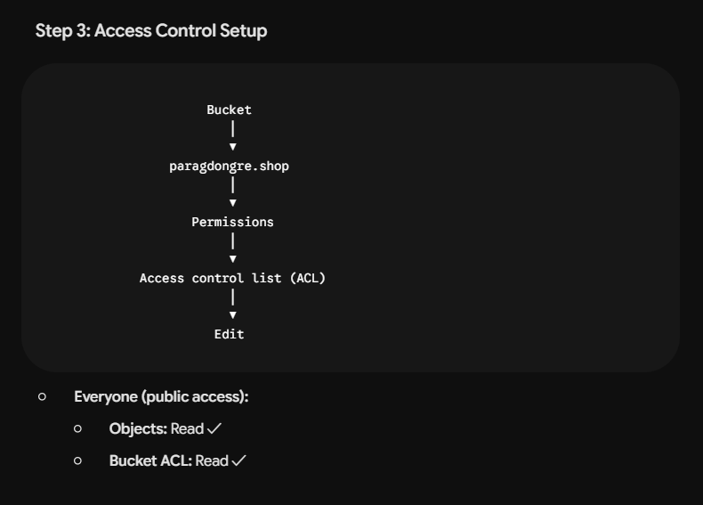


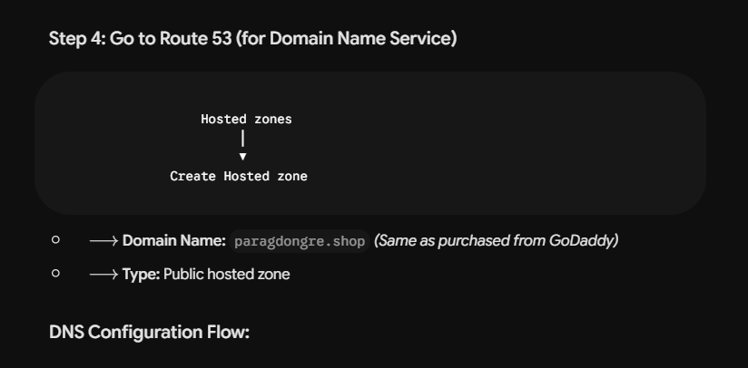


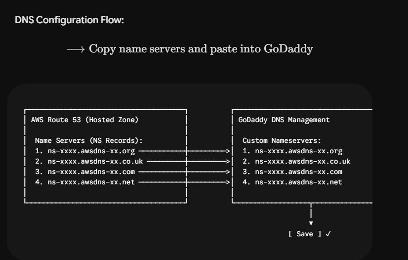


---

## **Page: 33**

#### **Step 3: Access Control Setup**

```
                     Bucket
                        │
                        ▼
                paragdongre.shop
                        │
                        ▼
                   Permissions
                        │
                        ▼
            Access control list (ACL)
                        │
                        ▼
                      Edit

```

* **Everyone (public access):**
* **Objects:** Read ✓
* **Bucket ACL:** Read ✓


---

#### **Step 4: Go to Route 53 (for Domain Name Service)**

```
                  Hosted zones
                       │
                       ▼
              Create Hosted zone

```

* $\longrightarrow$ **Domain Name:** `paragdongre.shop` *(Same as purchased from GoDaddy)*
* $\longrightarrow$ **Type:** Public hosted zone

---

#### **DNS Configuration Flow:**

$$\longrightarrow \text{Copy name servers and paste into GoDaddy}$$

```
┌──────────────────────────────────────┐          ┌──────────────────────────────────────┐
│ AWS Route 53 (Hosted Zone)           │          │ GoDaddy DNS Management               │
│                                      │          │                                      │
│  Name Servers (NS Records):          │          │  Custom Nameservers:                 │
│  1. ns-xxxx.awsdns-xx.org ───────────┼─────────>│  1. ns-xxxx.awsdns-xx.org            │
│  2. ns-xxxx.awsdns-xx.co.uk ─────────┼─────────>│  2. ns-xxxx.awsdns-xx.co.uk          │
│  3. ns-xxxx.awsdns-xx.com ───────────┼─────────>│  3. ns-xxxx.awsdns-xx.com            │
│  4. ns-xxxx.awsdns-xx.net ───────────┼─────────>│  4. ns-xxxx.awsdns-xx.net            │
│                                      │          │                                      │
└──────────────────────────────────────┘          └──────────────────┬───────────────────┘
                                                                     │
                                                                     ▼
                                                                [ Save ] ✓

```


--------------------xxxxxxxxxxxxxxxxxxxxxx-------------------


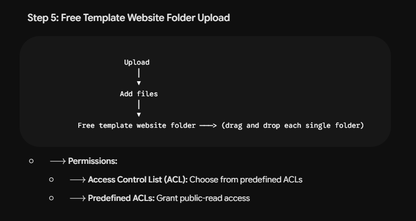


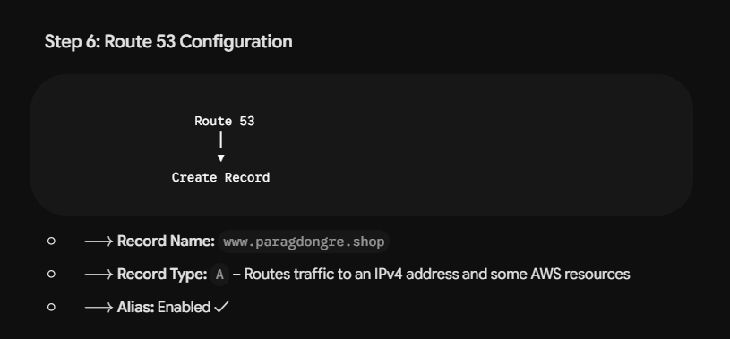


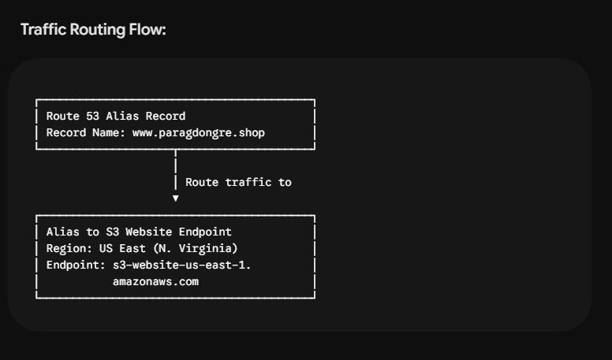


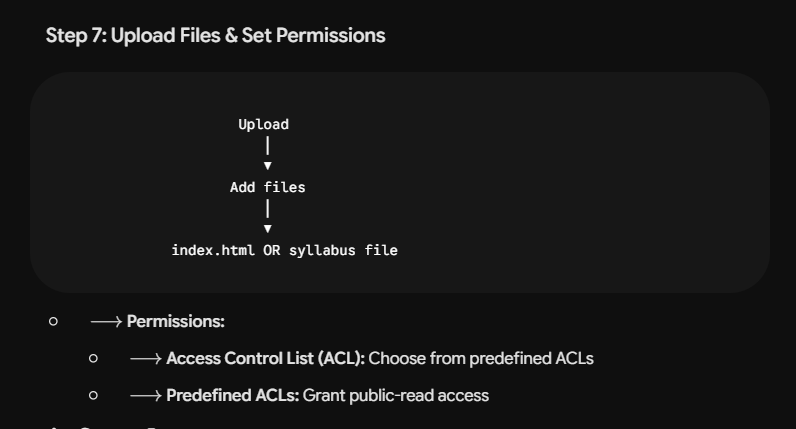


---

## **Page: 34**

#### **Step 5: Free Template Website Folder Upload**

```
                     Upload
                        │
                        ▼
                    Add files
                        │
                        ▼
          Free template website folder ───> (drag and drop each single folder)

```

* $\longrightarrow$ **Permissions:**
* $\longrightarrow$ **Access Control List (ACL):** Choose from predefined ACLs
* $\longrightarrow$ **Predefined ACLs:** Grant public-read access


---

#### **Step 6: Route 53 Configuration**

```
                  Route 53
                     │
                     ▼
               Create Record

```

* $\longrightarrow$ **Record Name:** `www.paragdongre.shop`
* $\longrightarrow$ **Record Type:** `A` – Routes traffic to an IPv4 address and some AWS resources
* $\longrightarrow$ **Alias:** Enabled ✓

##### **Traffic Routing Flow:**

```
┌─────────────────────────────────────────┐
│ Route 53 Alias Record                   │
│ Record Name: www.paragdongre.shop       │
└────────────────────┬────────────────────┘
                     │
                     │ Route traffic to
                     ▼
┌─────────────────────────────────────────┐
│ Alias to S3 Website Endpoint            │
│ Region: US East (N. Virginia)           │
│ Endpoint: s3-website-us-east-1.         │
│           amazonaws.com                 │
└─────────────────────────────────────────┘

```

---

#### **Step 7: Upload Files & Set Permissions**

```
                     Upload
                        │
                        ▼
                    Add files
                        │
                        ▼
             index.html OR syllabus file

```

* $\longrightarrow$ **Permissions:**
* $\longrightarrow$ **Access Control List (ACL):** Choose from predefined ACLs
* $\longrightarrow$ **Predefined ACLs:** Grant public-read access


------------------xxxxxxxxxxxxxxxxxxxxxxxxxxxx----------------------


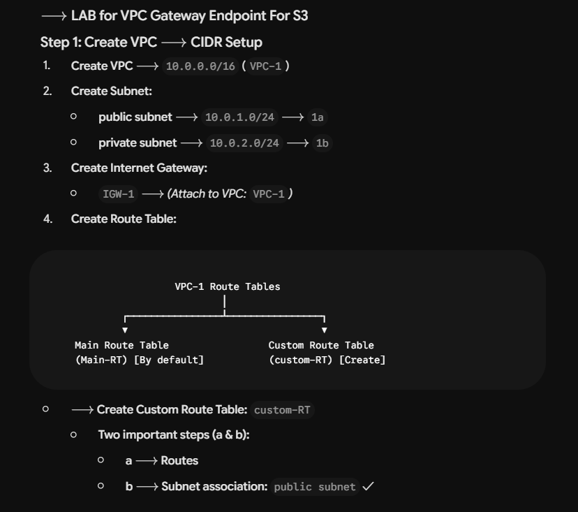


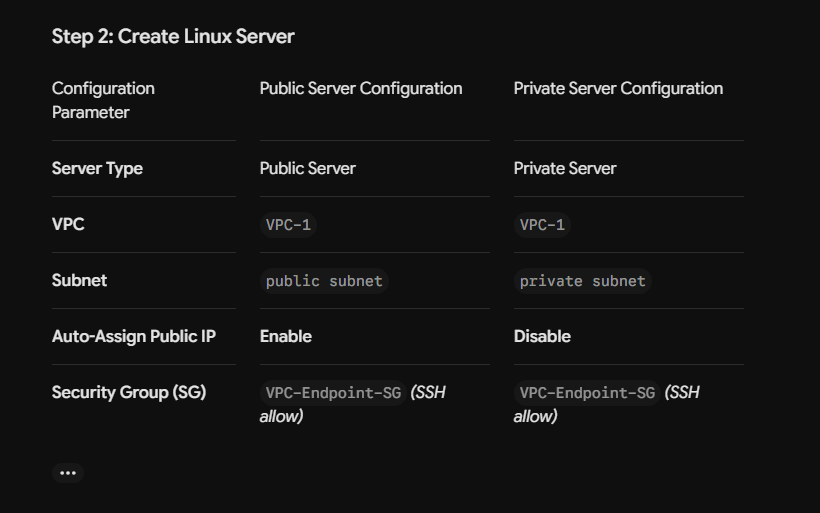


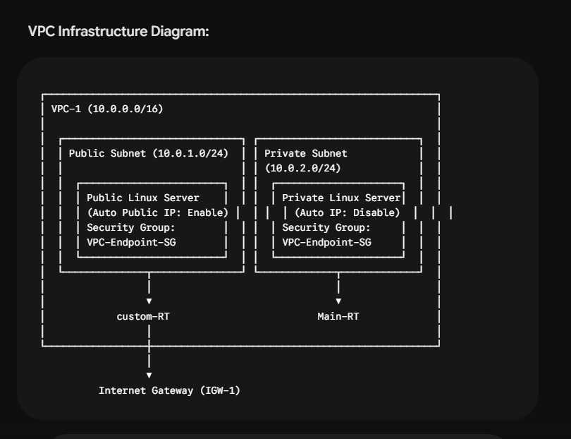


---

## **Page: 35**

### $\longrightarrow$ **LAB for VPC Gateway Endpoint For S3**

#### **Step 1: Create VPC $\longrightarrow$ CIDR Setup**

1. **Create VPC** $\longrightarrow$ `10.0.0.0/16` (`VPC-1`)
2. **Create Subnet:**
* **public subnet** $\longrightarrow$ `10.0.1.0/24` $\longrightarrow$ `1a`
* **private subnet** $\longrightarrow$ `10.0.2.0/24` $\longrightarrow$ `1b`


3. **Create Internet Gateway:**
* `IGW-1` $\longrightarrow$ *(Attach to VPC: `VPC-1`)*


4. **Create Route Table:**

```
                     VPC-1 Route Tables
                             │
            ┌────────────────┴────────────────┐
            ▼                                 ▼
    Main Route Table                 Custom Route Table
    (Main-RT) [By default]           (custom-RT) [Create]

```

* $\longrightarrow$ **Create Custom Route Table:** `custom-RT`
* **Two important steps (a & b):**
* **a** $\longrightarrow$ **Routes**
* **b** $\longrightarrow$ **Subnet association:** `public subnet` ✓


---

#### **Step 2: Create Linux Server**

| Configuration Parameter | Public Server Configuration | Private Server Configuration |
| --- | --- | --- |
| **Server Type** | Public Server | Private Server |
| **VPC** | `VPC-1` | `VPC-1` |
| **Subnet** | `public subnet` | `private subnet` |
| **Auto-Assign Public IP** | **Enable** | **Disable** |
| **Security Group (SG)** | `VPC-Endpoint-SG` *(SSH allow)* | `VPC-Endpoint-SG` *(SSH allow)* |

---

#### **VPC Infrastructure Diagram:**

```
┌──────────────────────────────────────────────────────────────────┐
│ VPC-1 (10.0.0.0/16)                                              │
│                                                                  │
│  ┌──────────────────────────────┐ ┌───────────────────────────┐  │
│  │ Public Subnet (10.0.1.0/24)  │ │ Private Subnet            │  │
│  │                              │ │ (10.0.2.0/24)             │  │
│  │  ┌────────────────────────┐  │ │  ┌─────────────────────┐  │  │
│  │  │ Public Linux Server    │  │ │  │ Private Linux Server│  │  │
│  │  │ (Auto Public IP: Enable) │  │ │  │ (Auto IP: Disable)  │  │  │
│  │  │ Security Group:        │  │ │  │ Security Group:     │  │  │
│  │  │ VPC-Endpoint-SG        │  │ │  │ VPC-Endpoint-SG     │  │  │
│  │  └────────────────────────┘  │ │  └─────────────────────┘  │  │
│  └──────────────┬───────────────┘ └─────────────┬─────────────┘  │
│                 │                               │                │
│                 ▼                               ▼                │
│            custom-RT                         Main-RT             │
│                 │                                                │
└─────────────────┼────────────────────────────────────────────────┘
                  │
                  ▼
          Internet Gateway (IGW-1)

```


----------------------xxxxxxxxxxxxxxxxxxxxxxx-------------------------


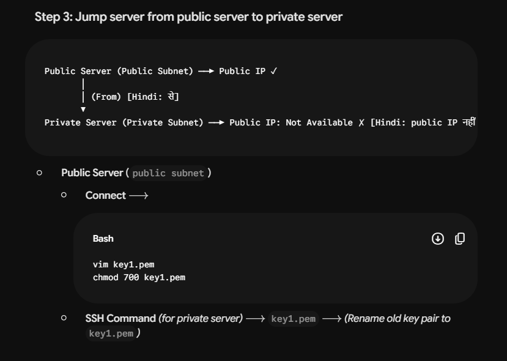


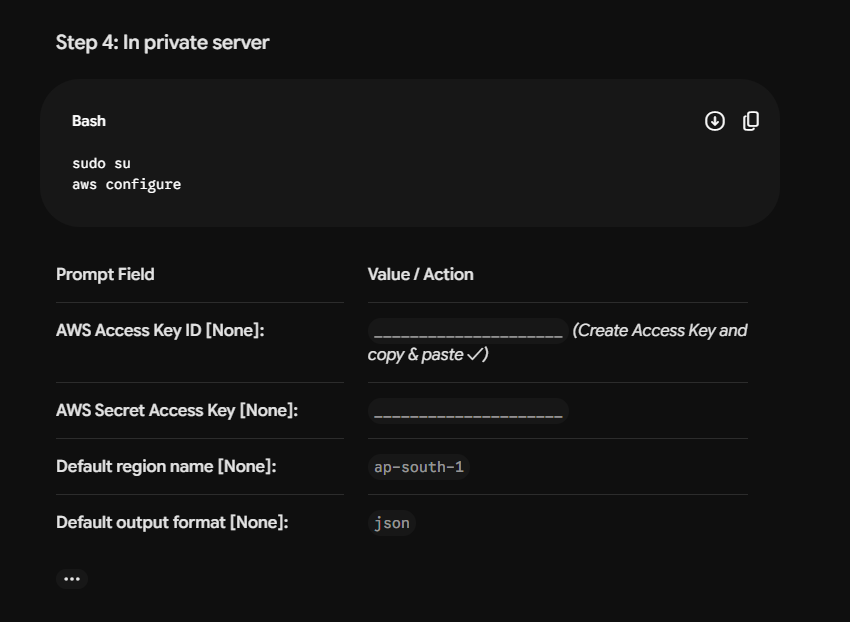


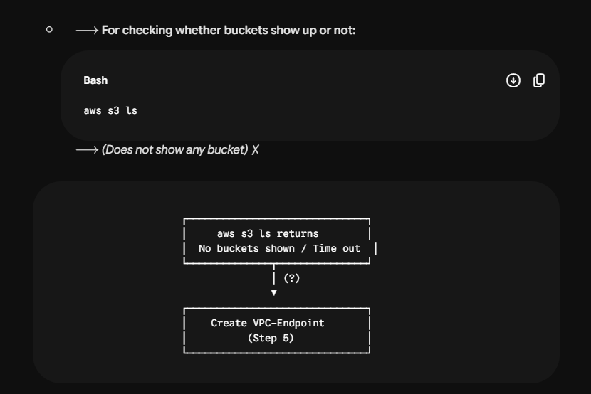


---

## **Page: 36**

### **Step 3: Jump server from public server to private server**

```
Public Server (Public Subnet) ──► Public IP ✓
       │
       │ (From) [Hindi: से]
       ▼
Private Server (Private Subnet) ──► Public IP: Not Available ✗ [Hindi: public IP नहीं है]

```

* **Public Server** (`public subnet`)
* **Connect** $\longrightarrow$
```bash
vim key1.pem
chmod 700 key1.pem

```


* **SSH Command** *(for private server)* $\longrightarrow$ `key1.pem` $\longrightarrow$ *(Rename old key pair to `key1.pem`)*


---

### **Step 4: In private server**

```bash
sudo su
aws configure

```

| Prompt Field | Value / Action |
| --- | --- |
| **AWS Access Key ID [None]:** | `_____________________` *(Create Access Key and copy & paste ✓)* |
| **AWS Secret Access Key [None]:** | `_____________________` |
| **Default region name [None]:** | `ap-south-1` |
| **Default output format [None]:** | `json` |

---

* $\longrightarrow$ **For checking whether buckets show up or not:**
```bash
aws s3 ls

```


$\longrightarrow$ *(Does not show any bucket)* ✗

```
                     ┌──────────────────────────────┐
                     │     aws s3 ls returns        │
                     │  No buckets shown / Time out  │
                     └──────────────┬───────────────┘
                                    │ (?)
                                    ▼
                     ┌──────────────────────────────┐
                     │    Create VPC-Endpoint       │
                     │          (Step 5)            │
                     └──────────────────────────────┘

```


-------------------xxxxxxxxxxxxxxxxxxx----------------------


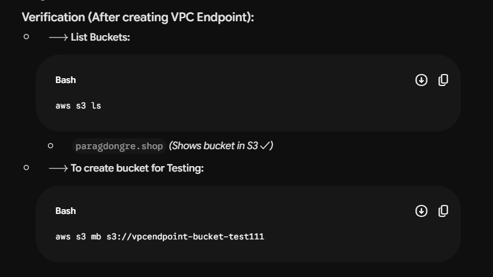


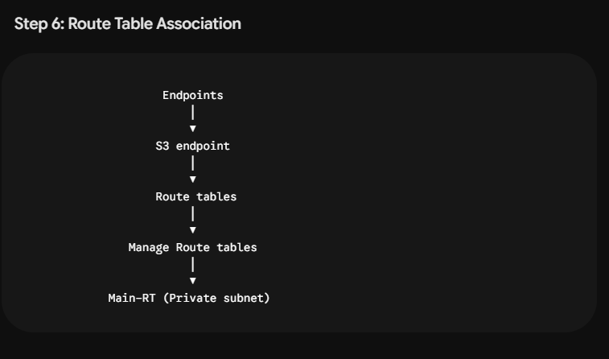


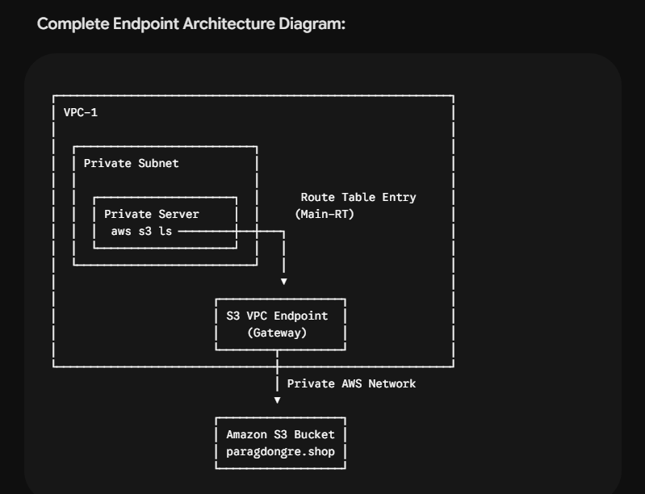


---

## **Page: 37**

### **Verification (After creating VPC Endpoint):**

* $\longrightarrow$ **List Buckets:**
```bash
aws s3 ls

```


* `paragdongre.shop` *(Shows bucket in S3 ✓)*


* $\longrightarrow$ **To create bucket for Testing:**
```bash
aws s3 mb s3://vpcendpoint-bucket-test111

```


---

### **Step 5: Create Gateway VPC Endpoint**

```
                       VPC
                        │
                        ▼
                    Endpoints
                        │
                        ▼
                 Create Endpoint

```

* $\longrightarrow$ **Name tag:** `S3 endpoint`
* $\longrightarrow$ **Type:** AWS Services
* $\longrightarrow$ **Services:**
* **Service Name:** `com.amazonaws.ap-south-1.s3`


* $\longrightarrow$ **Type:** Gateway
* $\longrightarrow$ **VPC:** `VPC-1`

---

### **Step 6: Route Table Association**

```
                    Endpoints
                        │
                        ▼
                   S3 endpoint
                        │
                        ▼
                   Route tables
                        │
                        ▼
               Manage Route tables
                        │
                        ▼
            Main-RT (Private subnet)

```

---

### **Complete Endpoint Architecture Diagram:**

```
┌──────────────────────────────────────────────────────────┐
│ VPC-1                                                    │
│                                                          │
│  ┌──────────────────────────┐                            │
│  │ Private Subnet           │                            │
│  │                          │                            │
│  │  ┌────────────────────┐  │      Route Table Entry     │
│  │  │ Private Server     │  │     (Main-RT)              │
│  │  │  aws s3 ls ────────┼──┼───┐                        │
│  │  └────────────────────┘  │   │                        │
│  └──────────────────────────┘   │                        │
│                                 ▼                        │
│                       ┌──────────────────┐               │
│                       │ S3 VPC Endpoint  │               │
│                       │    (Gateway)     │               │
│                       └────────┬─────────┘               │
└────────────────────────────────┼─────────────────────────┘
                                 │ Private AWS Network
                                 ▼
                        ┌──────────────────┐
                        │ Amazon S3 Bucket │
                        │ paragdongre.shop │
                        └──────────────────┘

```

-------------------xxxxxxxxxxxxxxxxxxxxxxxxx---------------------


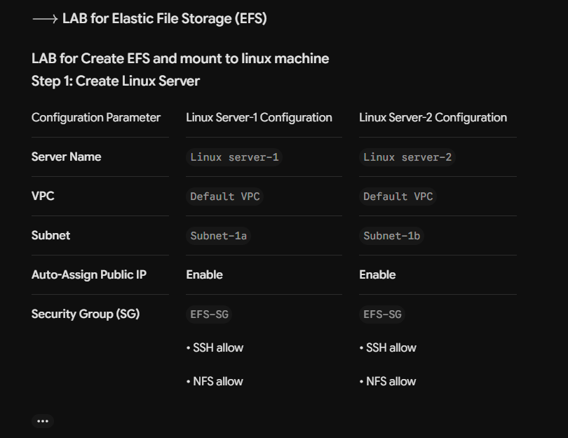


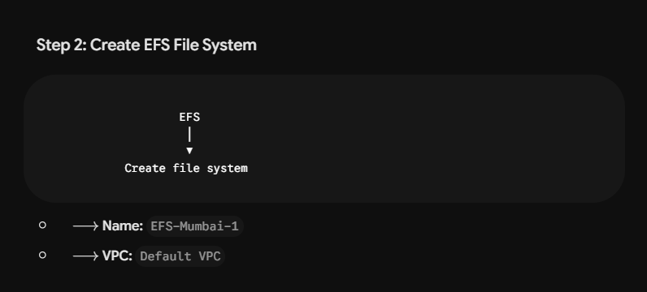


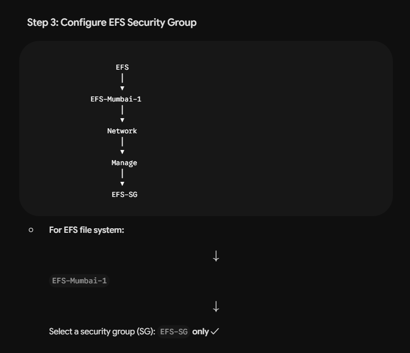


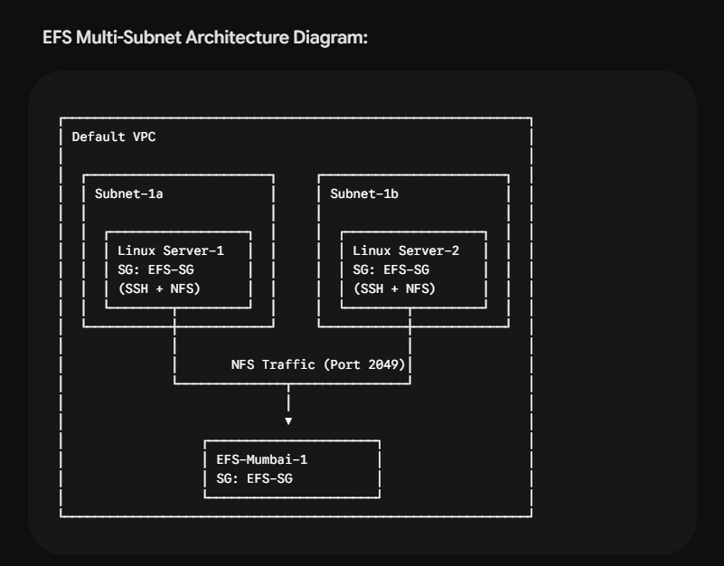


---

## **Page: 38**

### $\longrightarrow$ **LAB for Elastic File Storage (EFS)**

### **LAB for Create EFS and mount to linux machine**

#### **Step 1: Create Linux Server**

| Configuration Parameter | Linux Server-1 Configuration | Linux Server-2 Configuration |
| --- | --- | --- |
| **Server Name** | `Linux server-1` | `Linux server-2` |
| **VPC** | `Default VPC` | `Default VPC` |
| **Subnet** | `Subnet-1a` | `Subnet-1b` |
| **Auto-Assign Public IP** | **Enable** | **Enable** |
| **Security Group (SG)** | `EFS-SG`<br>

<br>• SSH allow<br>

<br>• NFS allow | `EFS-SG`<br>

<br>• SSH allow<br>

<br>• NFS allow |

---

#### **Step 2: Create EFS File System**

```
                   EFS
                    │
                    ▼
           Create file system

```

* $\longrightarrow$ **Name:** `EFS-Mumbai-1`
* $\longrightarrow$ **VPC:** `Default VPC`

---

#### **Step 3: Configure EFS Security Group**

```
                   EFS
                    │
                    ▼
             EFS-Mumbai-1
                    │
                    ▼
                 Network
                    │
                    ▼
                  Manage
                    │
                    ▼
                  EFS-SG

```

* **For EFS file system:**

$$\downarrow$$


`EFS-Mumbai-1`

$$\downarrow$$


Select a security group (SG): **`EFS-SG` only** ✓

---

#### **EFS Multi-Subnet Architecture Diagram:**

```
┌─────────────────────────────────────────────────────────────┐
│ Default VPC                                                 │
│                                                             │
│  ┌────────────────────────┐     ┌────────────────────────┐  │
│  │ Subnet-1a              │     │ Subnet-1b              │  │
│  │                        │     │                        │  │
│  │  ┌──────────────────┐  │     │  ┌──────────────────┐  │  │
│  │  │ Linux Server-1   │  │     │  │ Linux Server-2   │  │  │
│  │  │ SG: EFS-SG       │  │     │  │ SG: EFS-SG       │  │  │
│  │  │ (SSH + NFS)      │  │     │  │ (SSH + NFS)      │  │  │
│  │  └────────┬─────────┘  │     │  └────────┬─────────┘  │  │
│  └───────────┼────────────┘     └───────────┼────────────┘  │
│              │                              │               │
│              │       NFS Traffic (Port 2049)│               │
│              └──────────────┬───────────────┘               │
│                             │                               │
│                             ▼                               │
│                  ┌──────────────────────┐                   │
│                  │ EFS-Mumbai-1         │                   │
│                  │ SG: EFS-SG           │                   │
│                  └──────────────────────┘                   │
└─────────────────────────────────────────────────────────────┘

```


------------------xxxxxxxxxxxxxxxxxxxx---------------------


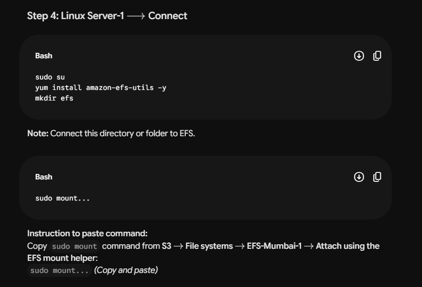


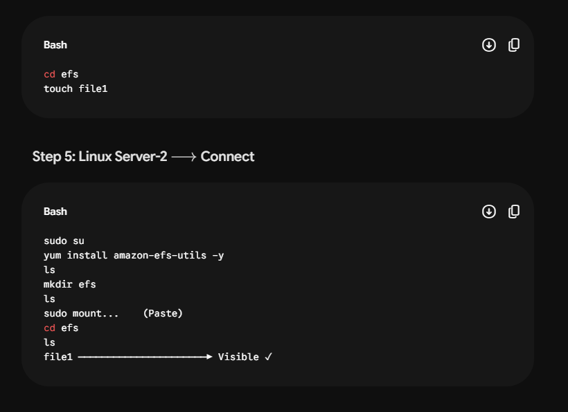


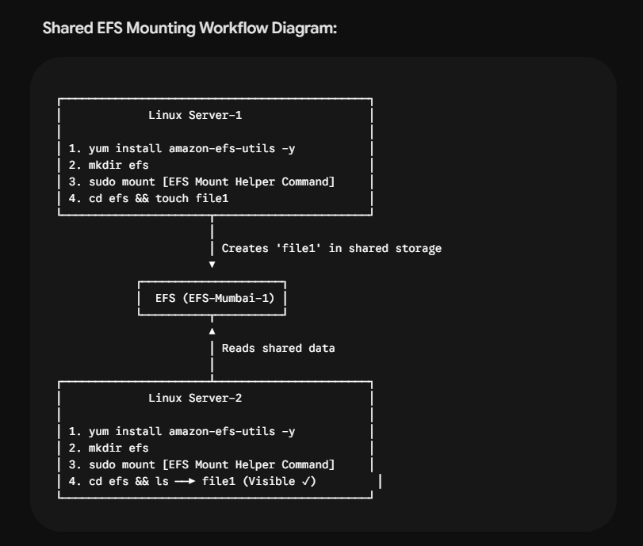


---

## **Page: 39**

### **Step 4: Linux Server-1 $\longrightarrow$ Connect**

```bash
sudo su
yum install amazon-efs-utils -y
mkdir efs

```

> **Note:** Connect this directory or folder to EFS.

```bash
sudo mount...

```

> **Instruction to paste command:**
> Copy `sudo mount` command from **S3** $\rightarrow$ **File systems** $\rightarrow$ **EFS-Mumbai-1** $\rightarrow$ **Attach using the EFS mount helper**:
> `sudo mount...` *(Copy and paste)*

```bash
cd efs
touch file1

```

---

### **Step 5: Linux Server-2 $\longrightarrow$ Connect**

```bash
sudo su
yum install amazon-efs-utils -y
ls
mkdir efs
ls
sudo mount...    (Paste)
cd efs
ls
file1 ──────────────────────► Visible ✓

```

---

### **Shared EFS Mounting Workflow Diagram:**

```
┌──────────────────────────────────────────────┐
│             Linux Server-1                   │
│                                              │
│ 1. yum install amazon-efs-utils -y           │
│ 2. mkdir efs                                 │
│ 3. sudo mount [EFS Mount Helper Command]     │
│ 4. cd efs && touch file1                     │
└──────────────────────┬───────────────────────┘
                       │
                       │ Creates 'file1' in shared storage
                       ▼
            ┌─────────────────────┐
            │  EFS (EFS-Mumbai-1) │
            └──────────┬──────────┘
                       ▲
                       │ Reads shared data
                       │
┌──────────────────────┴───────────────────────┐
│             Linux Server-2                   │
│                                              │
│ 1. yum install amazon-efs-utils -y           │
│ 2. mkdir efs                                 │
│ 3. sudo mount [EFS Mount Helper Command]     │
│ 4. cd efs && ls ──► file1 (Visible ✓)         │
└──────────────────────────────────────────────┘

```

--------------------xxxxxxxxxxxxxxxxxxxxxxxxxx----------------------


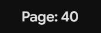


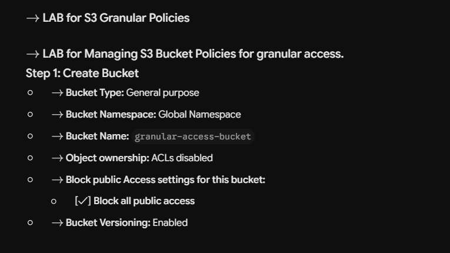


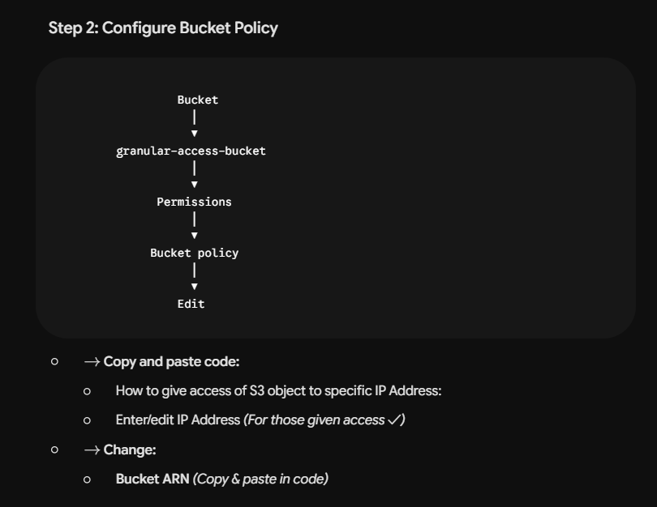


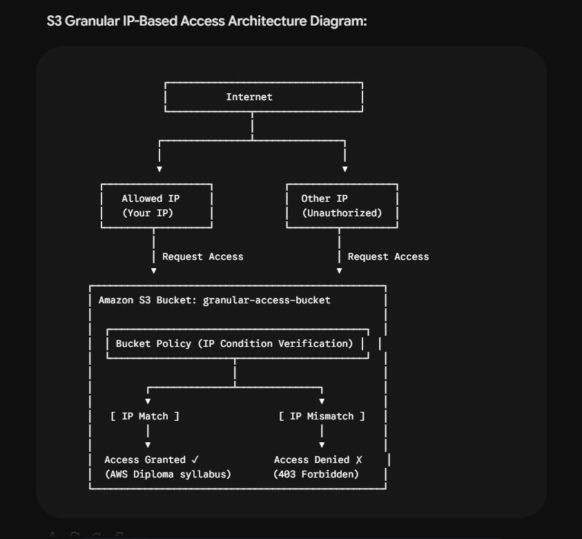


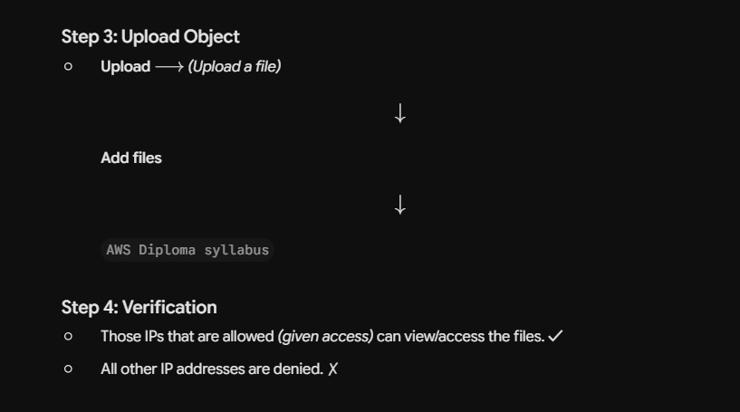


---

## **Page: 40**

### $\rightarrow$ **LAB for S3 Granular Policies**

### $\rightarrow$ **LAB for Managing S3 Bucket Policies for granular access.**

---

#### **Step 1: Create Bucket**

* $\rightarrow$ **Bucket Type:** General purpose
* $\rightarrow$ **Bucket Namespace:** Global Namespace
* $\rightarrow$ **Bucket Name:** `granular-access-bucket`
* $\rightarrow$ **Object ownership:** ACLs disabled
* $\rightarrow$ **Block public Access settings for this bucket:**
* [✓] **Block all public access**


* $\rightarrow$ **Bucket Versioning:** Enabled

---

#### **Step 2: Configure Bucket Policy**

```
                 Bucket
                   │
                   ▼
        granular-access-bucket
                   │
                   ▼
              Permissions
                   │
                   ▼
             Bucket policy
                   │
                   ▼
                 Edit

```

* $\rightarrow$ **Copy and paste code:**
* How to give access of S3 object to specific IP Address:
* Enter/edit IP Address *(For those given access ✓)*


* $\rightarrow$ **Change:**
* **Bucket ARN** *(Copy & paste in code)*


---

#### **Step 3: Upload Object**

* **Upload** $\longrightarrow$ *(Upload a file)*

$$\downarrow$$


**Add files**

$$\downarrow$$


`AWS Diploma syllabus`

---

#### **Step 4: Verification**

* Those IPs that are allowed *(given access)* can view/access the files. **✓**
* All other IP addresses are denied. **✗**

---

### **S3 Granular IP-Based Access Architecture Diagram:**

```
                  ┌─────────────────────────────────┐
                  │          Internet               │
                  └──────────────┬──────────────────┘
                                 │
                 ┌───────────────┴───────────────┐
                 │                               │
                 ▼                               ▼
       ┌──────────────────┐            ┌──────────────────┐
       │   Allowed IP     │            │  Other IP        │
       │   (Your IP)      │            │  (Unauthorized)  │
       └────────┬─────────┘            └────────┬─────────┘
                │                               │
                │ Request Access                │ Request Access
                ▼                               ▼
     ┌──────────────────────────────────────────────────┐
     │ Amazon S3 Bucket: granular-access-bucket         │
     │                                                  │
     │  ┌────────────────────────────────────────────┐  │
     │  │ Bucket Policy (IP Condition Verification) │  │
     │  └─────────────────────┬──────────────────────┘  │
     │                        │                         │
     │         ┌──────────────┴──────────────┐          │
     │         ▼                             ▼          │
     │   [ IP Match ]                 [ IP Mismatch ]   │
     │         │                             │          │
     │         ▼                             ▼          │
     │  Access Granted ✓             Access Denied ✗    │
     │  (AWS Diploma syllabus)       (403 Forbidden)    │
     └──────────────────────────────────────────────────┘

```

-------------------xxxxxxxxxxxxxxxxxxxxxxxxx--------------------


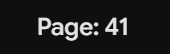


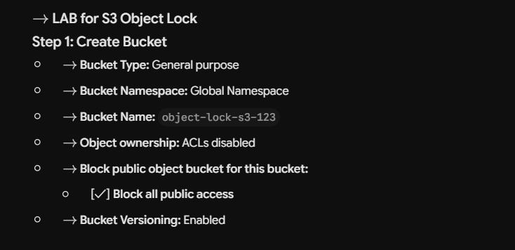


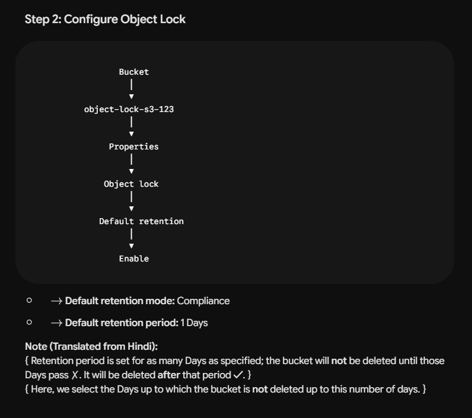


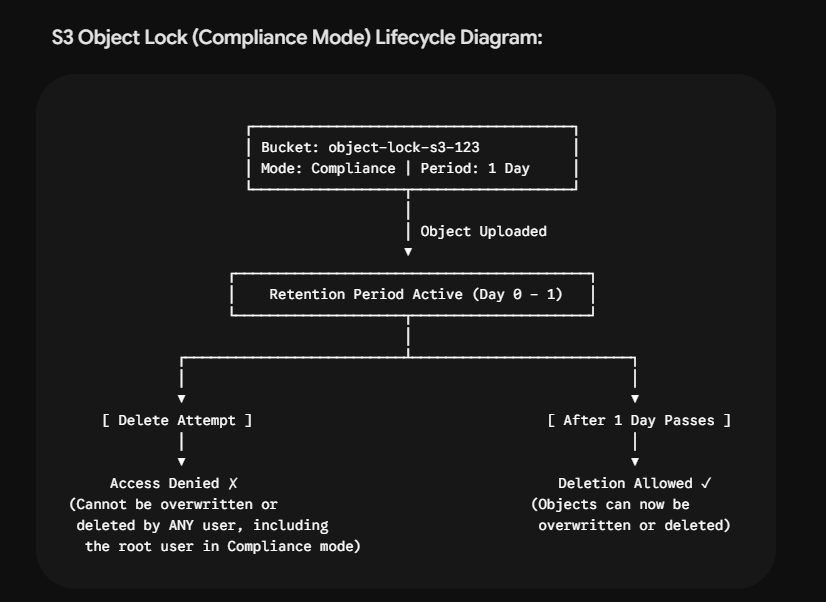


---

## **Page: 41**

### $\rightarrow$ **LAB for S3 Object Lock**

---

#### **Step 1: Create Bucket**

* $\rightarrow$ **Bucket Type:** General purpose
* $\rightarrow$ **Bucket Namespace:** Global Namespace
* $\rightarrow$ **Bucket Name:** `object-lock-s3-123`
* $\rightarrow$ **Object ownership:** ACLs disabled
* $\rightarrow$ **Block public object bucket for this bucket:**
* [✓] **Block all public access**


* $\rightarrow$ **Bucket Versioning:** Enabled

---

#### **Step 2: Configure Object Lock**

```
                 Bucket
                   │
                   ▼
          object-lock-s3-123
                   │
                   ▼
               Properties
                   │
                   ▼
              Object lock
                   │
                   ▼
             Default retention
                   │
                   ▼
                 Enable

```

* $\rightarrow$ **Default retention mode:** Compliance
* $\rightarrow$ **Default retention period:** 1 Days

> **Note (Translated from Hindi):**
> { Retention period is set for as many Days as specified; the bucket will **not** be deleted until those Days pass **✗**. It will be deleted **after** that period **✓**. }
> { Here, we select the Days up to which the bucket is **not** deleted up to this number of days. }

---

### **S3 Object Lock (Compliance Mode) Lifecycle Diagram:**

```
                     ┌──────────────────────────────────────┐
                     │ Bucket: object-lock-s3-123           │
                     │ Mode: Compliance | Period: 1 Day     │
                     └──────────────────┬───────────────────┘
                                        │
                                        │ Object Uploaded
                                        ▼
                   ┌──────────────────────────────────────────┐
                   │    Retention Period Active (Day 0 - 1)   │
                   └────────────────────┬─────────────────────┘
                                        │
             ┌──────────────────────────┴──────────────────────────┐
             │                                                     │
             ▼                                                     ▼
    [ Delete Attempt ]                                   [ After 1 Day Passes ]
             │                                                     │
             ▼                                                     ▼
     Access Denied ✗                                      Deletion Allowed ✓
(Cannot be overwritten or                              (Objects can now be
 deleted by ANY user, including                         overwritten or deleted)
  the root user in Compliance mode)

```


---------------xxxxxxxxxxxxxxxxxxxxxxxxxxxxx---------------------


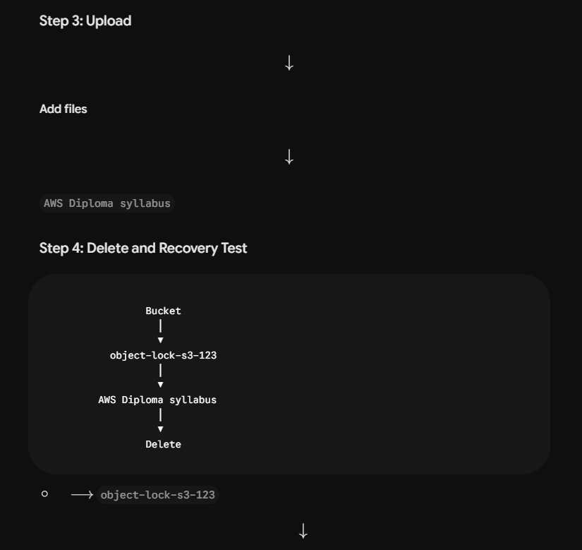


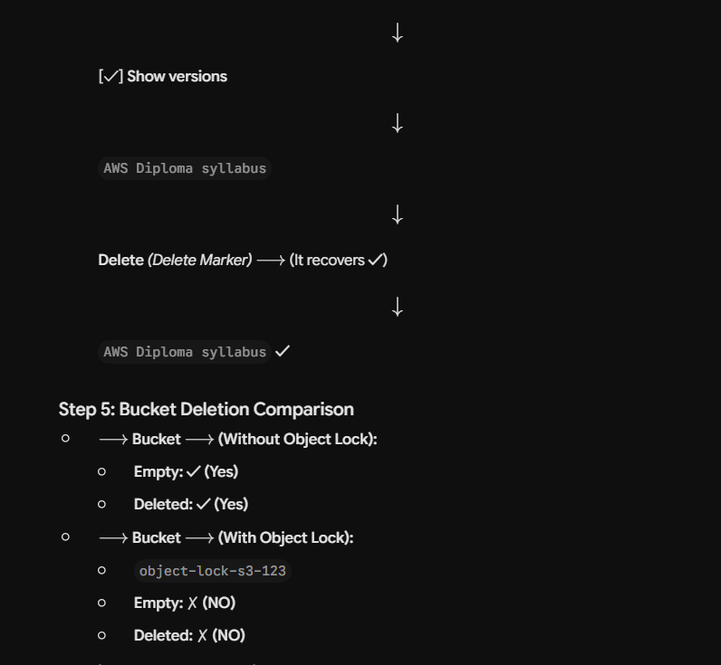


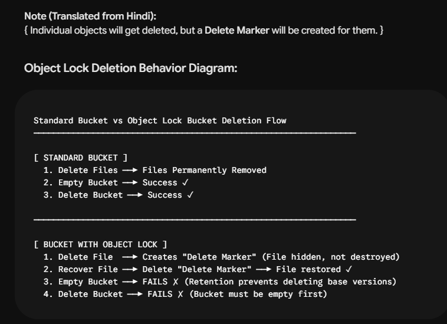


---

## **Page: 42**

#### **Step 3: Upload**

$$\downarrow$$


**Add files**


$$\downarrow$$


`AWS Diploma syllabus`

---

#### **Step 4: Delete and Recovery Test**

```
                Bucket
                  │
                  ▼
          object-lock-s3-123
                  │
                  ▼
        AWS Diploma syllabus
                  │
                  ▼
                Delete

```

* $\longrightarrow$ `object-lock-s3-123`

$$\downarrow$$


[✓] **Show versions**

$$\downarrow$$


`AWS Diploma syllabus`

$$\downarrow$$


**Delete** *(Delete Marker)* $\longrightarrow$ (It recovers **✓**)

$$\downarrow$$


`AWS Diploma syllabus` **✓**

---

#### **Step 5: Bucket Deletion Comparison**

* $\longrightarrow$ **Bucket** $\longrightarrow$ **(Without Object Lock):**
* **Empty:** **✓ (Yes)**
* **Deleted:** **✓ (Yes)**


* $\longrightarrow$ **Bucket** $\longrightarrow$ **(With Object Lock):**
* `object-lock-s3-123`
* **Empty:** **✗ (NO)**
* **Deleted:** **✗ (NO)**


> **Note (Translated from Hindi):**
> { Individual objects will get deleted, but a **Delete Marker** will be created for them. }

---

### **Object Lock Deletion Behavior Diagram:**

```
Standard Bucket vs Object Lock Bucket Deletion Flow
─────────────────────────────────────────────────────────────────

[ STANDARD BUCKET ]
  1. Delete Files ──► Files Permanently Removed
  2. Empty Bucket ──► Success ✓
  3. Delete Bucket ──► Success ✓

─────────────────────────────────────────────────────────────────

[ BUCKET WITH OBJECT LOCK ]
  1. Delete File  ──► Creates "Delete Marker" (File hidden, not destroyed)
  2. Recover File ──► Delete "Delete Marker" ──► File restored ✓
  3. Empty Bucket ──► FAILS ✗ (Retention prevents deleting base versions)
  4. Delete Bucket ──► FAILS ✗ (Bucket must be empty first)

```

-----------------xxxxxxxxxxxxxxxxxxxxxxxxxx----------------------


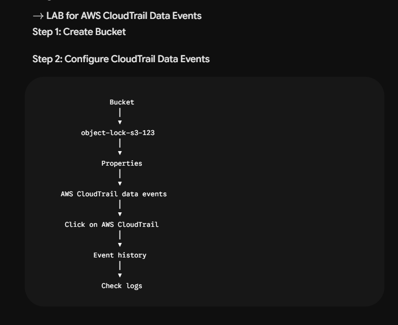


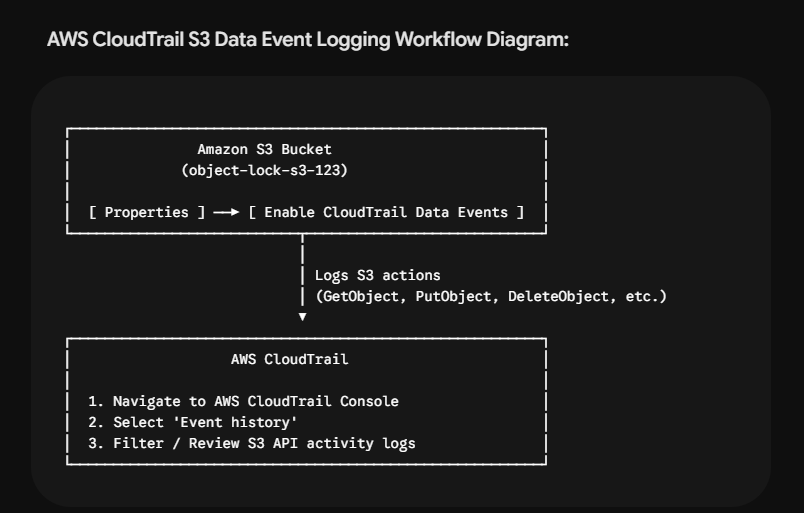


---

## **Page: 43**

### $\rightarrow$ **LAB for AWS CloudTrail Data Events**

---

#### **Step 1: Create Bucket**

---

#### **Step 2: Configure CloudTrail Data Events**

```
                 Bucket
                   │
                   ▼
          object-lock-s3-123
                   │
                   ▼
               Properties
                   │
                   ▼
     AWS CloudTrail data events
                   │
                   ▼
      Click on AWS CloudTrail
                   │
                   ▼
             Event history
                   │
                   ▼
               Check logs

```

---

### **AWS CloudTrail S3 Data Event Logging Workflow Diagram:**

```
┌────────────────────────────────────────────────────────┐
│               Amazon S3 Bucket                         │
│             (object-lock-s3-123)                       │
│                                                        │
│  [ Properties ] ──► [ Enable CloudTrail Data Events ]  │
└───────────────────────────┬────────────────────────────┘
                            │
                            │ Logs S3 actions
                            │ (GetObject, PutObject, DeleteObject, etc.)
                            ▼
┌────────────────────────────────────────────────────────┐
│                   AWS CloudTrail                       │
│                                                        │
│  1. Navigate to AWS CloudTrail Console                 │
│  2. Select 'Event history'                             │
│  3. Filter / Review S3 API activity logs               │
└────────────────────────────────────────────────────────┘

```

------------------xxxxxxxxxxxxxxxxxx---------------------